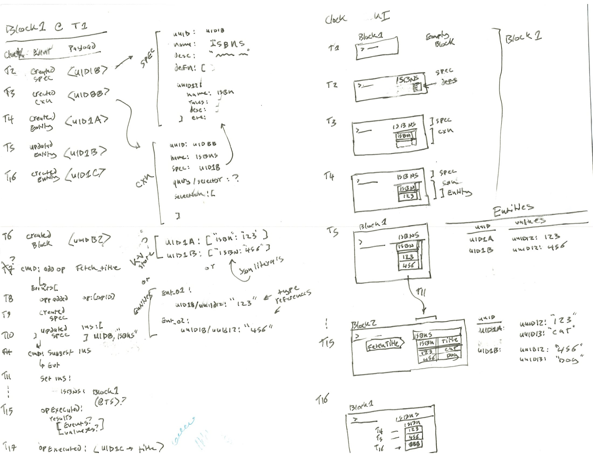
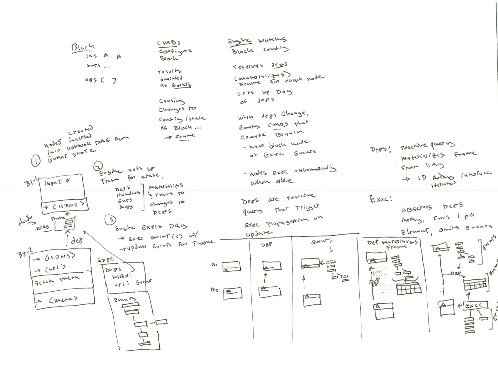

# atometa-cxn

playground for exploring how to design "causal tree" type CRDTs for computation graph + data input/output management and combine them with mobx for reactive frontend. see [docs/2020-jan_atometa-data-model.md](docs/2020-jan_atometa-data-model.md)





### background

##### CRDT / causal tree source code menagerie:
- https://github.com/courajs/ordt-demo/blob/master/src/ordts/sequence.js
- https://github.com/peer-base/js-delta-crdts
- https://docs.textile.io/a-tour-of-textile/
- http://archagon.net/blog/2018/03/24/data-laced-with-history/

##### related reading
- slides sketching out CRDTs https://speakerdeck.com/ept/convergence-versus-consensus-crdts-and-the-quest-for-distributed-consistency
- http://jtfmumm.com/blog/2015/11/17/crdt-primer-1-defanging-order-theory/
- https://blog.acolyer.org/2016/04/25/delta-state-replicated-data-types/
- https://blog.acolyer.org/2015/03/18/a-comprehensive-study-of-convergent-and-commutative-replicated-data-types/
- https://blog.acolyer.org/2019/11/25/mergeable-replicated-data-types-part-i/
- **recommended** 2018 kleppman (automerge) OpSets: Sequential Specifications for Replicated Datatypes (Extended Version) https://arxiv.org/pdf/1805.04263.pdf https://arxiv.org/pdf/1805.04263.pdf
- textile.io whitepaper (crdt + ipfs + event-sourcing + unidirectional UI -> redecer -> store data flow) https://blog.textile.io/introducing-textiles-threads-protocol/


## dev setup

```bash
git clone ...; cd 

# install
yarn 

# start react-cosmos component testing environment - like storybook, but more flexible (preferred)
yarn dev

# or serve app directly w/ webpack
yarn start
```

---

### built on top of [`mobx + react-hot-loader basic boilerplate`](https://github.com/100ideas/boilerplate-mobx-react-hot-loader) - README below

## get started
- clone repo https://github.com/100ideas/boilerplate-mobx-react-hot-loader
- `git checkout boilerplate`
  - this branch is the same as `react-hot-loader/examples/mobx` but upgraded for babel7


## development notes
- [`react-cosmos`](https://github.com/react-cosmos/react-cosmos) is included to facilitate rapid component prototyping (I find it a lot leaner, faster, and simpler than storybook especially and also docz).
  - start it with `yarn dev`
  - create components, then use them in `fixture` files. react-cosmost will render  them in isolation in the live hmr browser environment. to create fixtures:
    > End fixture file names with .fixture.{js,jsx,ts,tsx}
    > Put fixture files inside __fixtures__
  - `cosmos.decorator.js` files in the src allow you configure mock providers, themes, context etc for react-cosmos to  pass to `fixtures` 
  > A decorator only applies to fixture files contained in the decorator's directory. Decorators can be composed, in the order of their position in the file system hierarchy (from outer to inner).

- webpack has been configured to resolve modules first anywhere in `./src` and then in `./node_modules`
  - this means you can use absolute paths relative to `'./src` when you `import` modules 
  - or you can stick with relative paths
  ```js
  // in src/__fixtures__/CollectionViewer.fixture.js
  // you can use absolute paths like this
  import { CollectionViewer } from 'components/Collection'
  // instead of or in addition to relative paths like this
  import { CollectionViewer } from '../components/Collection'
  ```
  - thanks for the tip https://moduscreate.com/blog/es6-es2015-import-no-relative-path-webpack/
- to make changes to webpack's config, do so in both `webpack.config.babel.js` and in `webpack.override.js`. [The latter is needed by `cosmos-react` ](https://github.com/react-cosmos/react-cosmos#custom-webpack-config) becaause it uses its own webpack.

### concerns:
- react-hot-loader is complicated and I don't understand it.
- configured `webpack.resolve.module` to resolve 'src/' so modules can be imported from absolute paths (relative src)
  - for some reason `import { xxx } from 'util' was causing errors
    - because there is a "special" 'util' package at `node_modules/util`.
    - changing the name of `./src/util` -> `/src/utila` fixed it 
      - but there is also a `node_modules/utila`
      - so not sure what's going on
  - `vue-cli` uses webpack alias to prefix src/** with '@'
    - so there won't be any chance for collision with node_modules/ of the same name
    - https://github.com/facebook/create-react-app/issues/581#issuecomment-399081396
  - implemented it in cosmos webpack
  - `import { generateShortNanoId as nanoId } from '@/util';` works


## documentation

**TODO**: need to overhaul / remove react-hot-loader, its less useful now that I'm using cosmos & increases surfaace area for errors
- perhaps port this? TODO take inspiration from https://github.com/coryhouse/react-slingshot/blob/master/webpack.config.dev.js

- react-hot-loader https://github.com/gaearon/react-hot-loader
- @hot-loader/react-dom: https://github.com/hot-loader/react-dom (sometimes called `react-🔥-dom`)
- getting started guide http://gaearon.github.io/react-hot-loader/getstarted/#step-2-of-3-using-hmr-to-replace-the-root-component


#### babel
- upgrading programmatically: 
  - https://github.com/babel/babel-upgrade
  - `npx babel-upgrade --write`
- read this to avoid confusion! https://babeljs.io/docs/en/v7-migration
- **caution: upgrading decorator plugin** (order is important); https://babeljs.io/docs/en/babel-plugin-proposal-decorators
- https://babeljs.io/docs/en/next/babel-plugin-proposal-class-properties.html
- https://babeljs.io/docs/en/babel-preset-env
- https://babeljs.io/docs/en/babel-preset-react
- https://babeljs.io/docs/en/next/babel-preset-env.html
- https://babeljs.io/docs/en/next/babel-preset-react.html


## clone boilerplate from react-hot-loader examples
```
svn checkout https://github.com/gaearon/react-hot-loader/trunk/examples/mobx boilerplate-mobx-react-hot-loader
cd boilerplate-mobx-react-hot-loader
```
*note:** as of 2019-07-25 the mobx react-hot-loader example had outdated packages (`mobx`, `react`, `react-dom`, `react-hot-loader`). Upgrade them the work with `react@^16.8.6`. Then alias `react-dom` to `./node_modules/@hot-loader/react-dom' in `webpack.conf`.