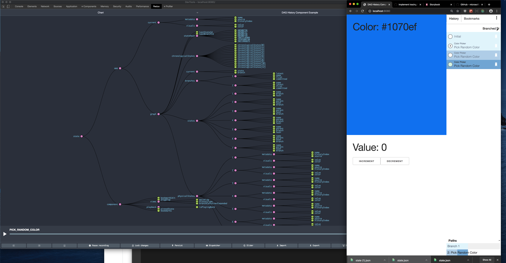
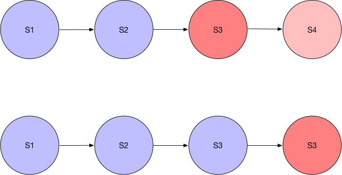
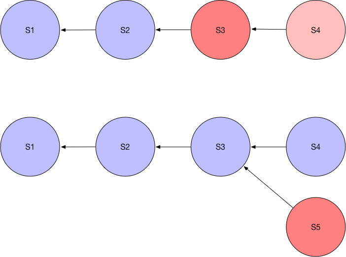
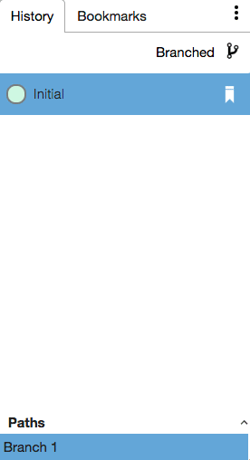

# microsoft redux-dag-history
https://github.com/microsoft/redux-dag-history
- local da-play/0_mock/2020-crdts/microsoft-redux-dag-history/
- use `nodenv local 10.16.0`
- `yarn`; `yarn start`; open `localhost:{8080|6006}` (demo|storybook)




```json5
// from dag-redux-tree app
// yarn start
//
// make changes w/ ui
// dev console: window.daggraph.print():

{
  "current": {
    "state": "12",
    "branch": "3"
  },
  "chronologicalStates": [
    "1",
    "2",
    "3",
    "4",
    "5",
    "2",
    "2",
    "1",
    "6",
    "7",
    "8",
    "9",
    "9",
    "8",
    "8",
    "8",
    "10",
    "11",
    "12",
    "13",
    "13",
    "13",
    "13",
    "13",
    "13",
    "13",
    "13",
    "13",
    "13",
    "13",
    "12"
  ],
  "branches": {
    "1": {
      "latest": "5",
      "name": "Branch 1",
      "first": "1",
      "committed": "1"
    },
    "2": {
      "name": "2: Decrement Value",
      "latest": "9",
      "first": "6",
      "committed": "8"
    },
    "3": {
      "name": "3: Increment Value",
      "latest": "13",
      "first": "10",
      "committed": "12"
    }
  },
  "states": {
    "1": {
      "name": "Initial",
      "branch": "1",
      "hash": "2021996825"
    },
    "2": {
      "name": "Increment Value",
      "parent": "1",
      "branch": "1",
      "hash": "2021996826"
    },
    "3": {
      "name": "Increment Value",
      "parent": "2",
      "hash": "2021996827",
      "branch": "1"
    },
    "4": {
      "name": "Increment Value",
      "parent": "3",
      "hash": "2021996828",
      "branch": "1"
    },
    "5": {
      "name": "Pick Random Color",
      "parent": "4",
      "hash": "470227833",
      "branch": "1"
    },
    "6": {
      "name": "Decrement Value",
      "parent": "1",
      "hash": "-1742607909",
      "branch": "2"
    },
    "7": {
      "name": "Decrement Value",
      "parent": "6",
      "hash": "-1742607908",
      "branch": "2"
    },
    "8": {
      "name": "Pick Random Color",
      "parent": "7",
      "branch": "2",
      "hash": "-1658500898"
    },
    "9": {
      "name": "Pick Random Color",
      "parent": "8",
      "hash": "-1759085733",
      "branch": "2"
    },
    "10": {
      "name": "Increment Value",
      "parent": "8",
      "hash": "-1658500899",
      "branch": "3"
    },
    "11": {
      "name": "Increment Value",
      "parent": "10",
      "hash": "-1577520681",
      "branch": "3"
    },
    "12": {
      "name": "Increment Value",
      "parent": "11",
      "hash": "-1577520680",
      "branch": "3"
    },
    "13": {
      "name": "Increment Value",
      "parent": "12",
      "branch": "3",
      "hash": "-1577520679"
    }
  },
  "dag": {
    "id": "1",
    "name": "Initial",
    "children": [
      {
        "id": "2",
        "name": "Increment Value",
        "children": [
          {
            "id": "3",
            "name": "Increment Value",
            "children": [
              {
                "id": "4",
                "name": "Increment Value",
                "children": [
                  {
                    "id": "5",
                    "name": "Pick Random Color",
                    "children": []
                  }
                ]
              }
            ]
          }
        ]
      },
      {
        "id": "6",
        "name": "Decrement Value",
        "children": [
          {
            "id": "7",
            "name": "Decrement Value",
            "children": [
              {
                "id": "8",
                "name": "Pick Random Color",
                "children": [
                  {
                    "id": "9",
                    "name": "Pick Random Color",
                    "children": []
                  },
                  {
                    "id": "10",
                    "name": "Increment Value",
                    "children": [
                      {
                        "id": "11",
                        "name": "Increment Value",
                        "children": [
                          {
                            "id": "12",
                            "name": "Increment Value",
                            "children": [
                              {
                                "id": "13",
                                "name": "Increment Value",
                                "children": []
                              }
                            ]
                          }
                        ]
                      }
                    ]
                  }
                ]
              }
            ]
          }
        ]
      }
    ]
  }
}
```


---

# 2017 Trevidon dag-redux-tree - Exploring Interaction History

[](/@darthtrevino?source=post_page-----d09a52a7d186----------------------)

<span class="au b bi bj bk bl r cw q"></span>

<span class="au ff fg bj ay fh ba bb bc bd cw"><a href="/@darthtrevino?source=post_page-----d09a52a7d186----------------------" class="fi fj bq br bs bt bu bv bw bx fk ca cb fl fm">Chris Trevino</a></span>

<a href="https://medium.com/m/signin?operation=register&amp;redirect=https%3A%2F%2Fblog.atsid.com%2Fexploring-interaction-history-d09a52a7d186&amp;source=-bbfbae62e50c-------------------------follow_byline-" class="fo cw q cf fp fq fr fs bx fl ft fu fv fw fx fy ci au b bi fz ga bl cj ck cl cm cn ca">Follow</a>

<span class="au b bi bj bk bl r bm bn"><span class="au ff fg bj ay fh ba bb bc bd bm"></span></span>

<a href="/exploring-interaction-history-d09a52a7d186?source=post_page-----d09a52a7d186----------------------" class="fi fj bq br bs bt bu bv bw bx fk ca cb fl fm">Jan 27, 2017</a> · 4 min read

(i.e. Introducing <a href="https://github.com/Microsoft/redux-dag-history" class="fi cn hb hc hd he">redux-dag-history</a>)

In our recent work with <a href="https://www.microsoft.com/en-us/research/" class="fi cn hb hc hd he">Microsoft Research</a> and <a href="http://uncharted.software" class="fi cn hb hc hd he">Uncharted</a>, we’ve been working with various tools for understanding masses of unstructured data. We’ve been working on various data processing, collection, visualization, interaction, and exploration techniques. Unstructured data does not lend itself well to high-level summary type visualizations. Instead, a big part of our work has been designing a user experience for exploring this data and sifting towards meaningful conclusions efficiently. Part of that effort has been implementing a class of highly interactive data visualizations that can be used in a variety of contexts, including <a href="https://powerbi.microsoft.com/en-us/" class="fi cn hb hc hd he">Microsoft’s PowerBI</a>. As a part of this effort, we explored the concepts of redux “time-travel” and state-injection to develop a unique way of tracking data exploration.

Our first development effort was a standalone data-visualization application using custom components from <a href="http://uncharted.software" class="fi cn hb hc hd he">Uncharted</a>, <a href="https://github.com/Caleydo/lineupjs" class="fi cn hb hc hd he">Caleydo</a>, and other PowerBI custom visuals. The UI for this effort was architected using <a href="https://facebook.github.io/react/" class="fi cn hb hc hd he">React</a> and <a href="http://redux.js.org/" class="fi cn hb hc hd he">redux</a>, and data was queried using <a href="http://graphql.org/" class="fi cn hb hc hd he">GraphQL</a> and <a href="https://facebook.github.io/relay/" class="fi cn hb hc hd he">Relay</a>. In order to gain traction with these efforts, we migrated these visuals from our custom environment into PowerBI itself. These visuals are freely available on PowerBI, and have been published under Microsoft’s Github account (<a href="https://github.com/Microsoft/PowerBI-visuals-AttributeSlicer" class="fi cn hb hc hd he">[1]</a><a href="https://github.com/Microsoft/PowerBI-visuals-ClusterMap" class="fi cn hb hc hd he">[2]</a><a href="https://github.com/Microsoft/PowerBI-visuals-FacetKey" class="fi cn hb hc hd he">[3]</a><a href="https://github.com/Microsoft/PowerBI-visuals-History" class="fi cn hb hc hd he">[4]</a><a href="https://github.com/Microsoft/PowerBI-visuals-NetworkNavigator" class="fi cn hb hc hd he">[5]</a><a href="https://github.com/Microsoft/PowerBI-visuals-StrippetsBrowser" class="fi cn hb hc hd he">[6]</a><a href="https://github.com/Microsoft/PowerBI-visuals-TableSorter" class="fi cn hb hc hd he">[7]</a><a href="https://github.com/Microsoft/PowerBI-visuals-TimeBrush" class="fi cn hb hc hd he">[8]</a>).

A side effect of this effort, however, was our novel method of interaction history that emerged. As mentioned above, we were using redux to manage our application state. Redux is an application state container technology that presented some clear advantages to us, particularly by providing stable and predictable state handling via synchronous, pure JavaScript functions. In most stateful applications, application-state is derived from a sequence of interactions, and replicating a specific state can often be cumbersome, if it’s at all possible. By using redux to manage our state, we made the rendering of our visuals in particular scenarios much easier to reason about, and much easier to instrument using “time travel,” which is the redux-specific term for being able to *render an application at any point by injecting state into the state-container,* instead of progressing through intermediate steps. <a href="/flux-and-presentation-architectures-91283f7ef94b" class="fi cn hb hc hd he">I wrote a brief article on presentation architectures previously</a> that goes in to a bit more detail.

We had originally implemented a standard history stack using <a href="https://github.com/omnidan/redux-undo" class="fi cn hb hc hd he">redux-undo</a>, but this proved to be constricting in this kind of application. Most history implementations work by defining an “undo-stack”. Undo operations change the current state of the application, but performing actions in the middle of the stack is destructive towards state after that point. This precludes the ability to be able to revert towards previous lines of thought. We think it would be incredibly useful for applications to track these lines of thought, and allow users to return to a previous line of thinking (similar to a global browser history).

<figure><figcaption>Traditional History Insert — S3 is active; when a new action is inserted S4 and children are eliminated</figcaption></figure>

Our research partner from Microsoft, <a href="https://www.microsoft.com/en-us/research/people/daedge/" class="fi cn hb hc hd he">Darren Edge</a>, suggested stretching the notion of application history further to see how much we could push the time-travel concept. By taking the data structure of Git as our inspiration, and using the higher-order-reducer pattern used in <a href="https://github.com/omnidan/redux-undo" class="fi cn hb hc hd he">redux-undo</a>, we implemented our own history middleware; however, instead of modeling states history states as a traditional stack, we implemented it as a directed-acyclic-graph (DAG). Each state references a parent state, and instead of deleting actions, we fork from a common parent and are now dealing with “exploration branches”.

By preserving the historical actions of a user, and alternative paths of exploring a data-space, we can start thinking of a lot of compelling use cases, such as comparing alternative explorations, establishing competing data narratives, tracking the provenance of conclusions, auditing, and workspace sharing between users.

<figure><figcaption>In a branched history model, actions that normally destroy the extant state path instead fork off into an alternate timeline.</figcaption></figure>

We’ve been using it as a stepping-stone for thinking about how to tell stories with data, and <a href="https://github.com/Microsoft/redux-dag-history" class="fi cn hb hc hd he">we’ve recently released it as open-source software on Github.</a> We are currently exploring how we can utilize this concept to support richer interaction tracking within PowerBI.

The middleware has several unique features as well. Clients can optionally perform duplicate-state-detection by implementing a hash function, and instead of inserting a duplicate state, we would jump to it, eliminating duplicates among states, and giving richer detail on how threads of thought intersect. Users can ‘pin’ a state with several children to compare between alternate successor states on different branches. And we can determine the shortest route it takes from the root state to an end state, to support streamlined narratives.

This library, <a href="https://github.com/Microsoft/redux-dag-history" class="fi cn hb hc hd he"><strong>redux-dag-history</strong></a>, only provides the middleware for describing the DAG-based state. A sister library to this is a React-component library that presents history, alternative branches, and a basic UI for describing a narrative. That library is the <a href="https://github.com/Microsoft/dag-history-component" class="fi cn hb hc hd he"><strong>dag-history-component</strong></a>**.**

<figure><figcaption>Interaction with the dag-history-component</figcaption></figure>

These libraries remain a work in development. For example, there are non-trivial memory implications about preserving multiple copies of application state without limit. We’ve mitigated this to a degree by using <a href="https://facebook.github.io/immutable-js/" class="fi cn hb hc hd he">ImmutableJS</a>, which uses structural memory sharing, where we can, but it’s a problem we’ll need to address fully at some point.

We hope that these libraries are compelling enough to try out, and welcome community contributions and ideas. Many thanks to our partners at <a href="http://uncharted.software" class="fi cn hb hc hd he">Uncharted</a> and <a href="https://www.microsoft.com/en-us/research/" class="fi cn hb hc hd he">Microsoft Research</a>, and to <a href="https://www.microsoft.com/en-us/research/people/daedge/" class="fi cn hb hc hd he">Darren Edge</a> for his guidance and unending flow of ideas. The future of interaction history lies in the ability to compare, analyze, and snap between competing lines of thought, and we believe this can empower deeper interactions in many categories of applications.

<a href="https://blog.atsid.com/?source=post_sidebar--------------------------post_sidebar-" class="fi fj bq br bs bt bu bv bw bx gk gl ca cb fl fm"></a>

## ATS Blog

#### We love to learn, and we love to share. See what our team has been up to lately.

<a href="https://medium.com/m/signin?operation=register&amp;redirect=https%3A%2F%2Fblog.atsid.com%2Fexploring-interaction-history-d09a52a7d186&amp;source=post_sidebar--------------------------follow_sidebar-" class="jd cf bo bp cg by bz ch bx ci au b bi bj bk bl cj ck cl cm cn ca">Follow</a>

<a href="https://medium.com/m/signin?operation=register&amp;redirect=https%3A%2F%2Fblog.atsid.com%2Fexploring-interaction-history-d09a52a7d186&amp;source=post_sidebar-----d09a52a7d186---------------------clap_sidebar-" class="fi fj bq br bs bt bu bv bw bx gk gl ca cb fl fm"></a>

#### 33

#### Thanks to Nathan Evans. 

---

## comments


[Holger Stitz](https://medium.com/@holger.stitz) - Apr 4, 2017 · 1 min read

Thanks for the great article and crediting Caleydo LineUp. Last year the Caleydo team published the work about CLUE (Capture, Label, Understand, Explain), wich is similar to your work with redux-dag-history. You can take a look at the research paper and demos at http://caleydo.org/publications/2016_eurovis_clue/ .
> For example, there are non-trivial memory implications about preserving multiple copies of application state without limit.
To avoid (or workaround) the provenance graph in CLUE (in your case dag-history) can be either stored in the browser’s SessionStorage or remote on a server. But this is also not the perfect solution.
One important difference between both concepts is the state itself. A redux state contains always the full application state and the application can be restored with a single state represenation.
However, in CLUE all subsequent actions lead to a state (similar to a difference backup). This means for restoring a state all actions that lead to this state must be loaded and executed.