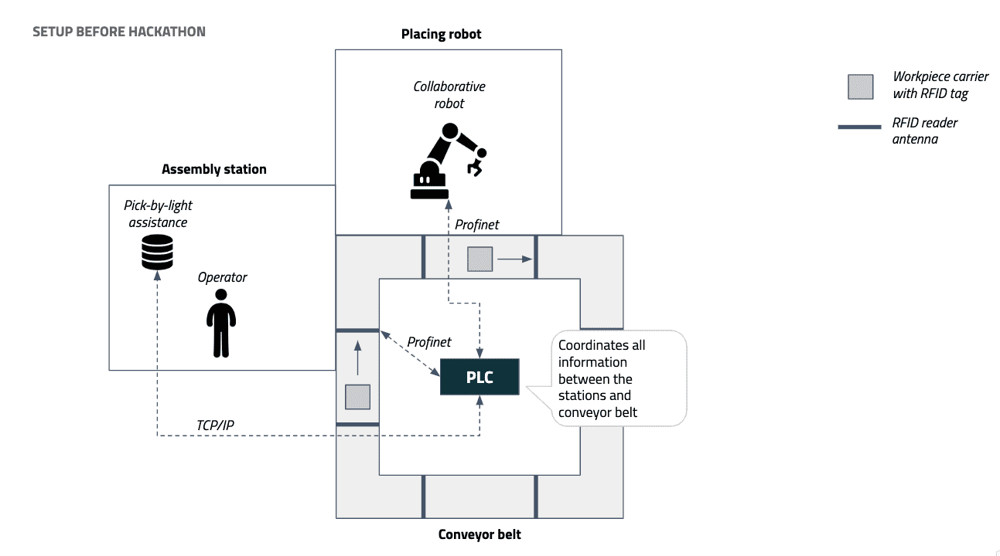
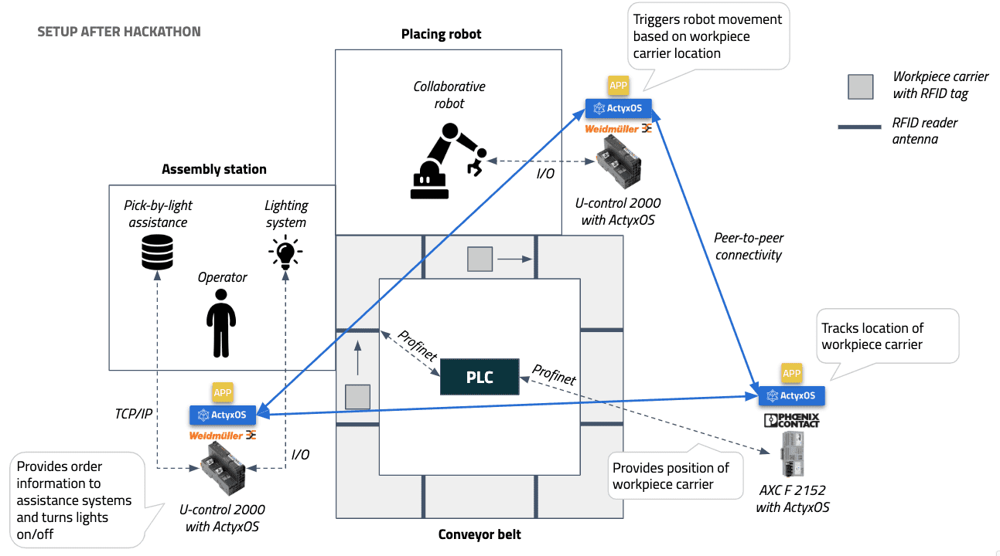

# Actyx blog: Hackathon at the SmartFactoryOWL Dec/19
https://www.actyx.com/blog/2019/12/19/Smart%20Factory-OWL-hackathon.html

December 19, 2019 by <a href="https://twitter.com/rolandkuhn" class="css-wh4gdh">Dr. Roland Kuhn</a> and <a href="https://www.iosb.fraunhofer.de/servlet/is/Entry.74225.Display/" class="css-wh4gdh">Sascha Heymann</a>

[SmartFactoryOWL](https://smartfactory-owl.de/index.php/de/) hosted an industry hackathon with Actyx to evaluate a new peer-to-peer communication approach to inter-machine factory automation, replacing the high-level coordination functions traditionally performed by overlaid PLCs with IT tools to reduce the implementation effort and enable fully dynamic and modular setups.

## The challenge

The question had been on Sascha Heymann’s mind for quite some time: we automate processes within single machines and their components with operational technology (OT) since decades but suffer from an impedance mismatch when expanding this to higher level — possibly dynamic — inter-machine collaboration due to the strictly fixed IEC61131 environment; can we not bridge this gap using information technology (IT) instead? The SmartFactoryOWL hosts a demonstrator combining many individually intelligent parts (conveyor belts, augmented reality workstation, robots). The implementation eschews a decentral approach with per-module PLCs in favor of a central PLC due to the implementation complexity in synchronizing the communication and data models that would be needed for a more modular and distributed approach.

To answer this question, Heymann organised a hackathon together with Actyx, a Munich-based software startup offering a platform for automating collaboration on the factory shop-floor. This topic is also keenly observed by automation vendors like PHOENIX CONTACT and Weidmüller, who promptly joined the event and supplied next-generation PLC hardware that can run not only real time control code but also non-real time standard Linux processes for higher-level communication and coordination tasks. Among the participants who registered for the hackathon were students of TH OWL but also seasoned automation experts from Arend Prozessautomation as well as engineers from PHOENIX CONTACT and Beckhoff.

<a href="/static/566175a0032742304f9ebca9c2fdf9ed/0a443/participants.jpg" class="gatsby-resp-image-link">    </a>

The challenge formulated for the hackathon was to split the logic hosted by the central PLC into autonomous pieces hosted on per-module PLCs and let these PLCs communicate only via ActyxOS, a peer-to-peer serverless distributed operating system for the factory shop-floor. If this succeeded then Heymann would have his answer: that it is indeed possible to use the more malleable IT approach for high-level inter-machine coordination instead of the high-effort OT approach.

> Interested in also joining the next hackathon at the Smart Factory OWL? Sign up [here](https://smartfactory-owl.de/index.php/de/veranstaltungen/smartfactoryowl/96-actyx-hackathon).

## Setting the stage

The preparations began after lunch on Monday, Dec 2: three engineers from Actyx arrived at the SmartFactoryOWL in Lemgo and were joined by Arno Fast from PHOENIX CONTACT who brought several PLCnext controllers. Together with Heymann they started setting up these and the Weidmüller u-control units, integrating them into the machine network and installing ActyxOS.

The SmartFactory hosts a variety of research setups in a real-world evaluation setting, from a towel folding machine over additive manufacturing to grain sorting. The most complex demonstrator combines an intelligent conveyor belt system with smart workpiece carriers, an augmented reality hand-working assembly station, robot arms for placement and inspection, an engraving laser, and more. Previously, the coordination of this whole setup had been implemented with a central PLC, tightly coupling all production modules together; this is not only inflexible in terms of effort when rearranging the setup, it was also a lot of effort to program. Therefore this demonstrator was picked to evaluate the decentralised IT approach.

## The hackathon

On Tuesday we started with an introduction to the SmartFactoryOWL by Heymann, followed by an overview and training in the use of ActyxOS by Actyx. During this session the participants experienced first-hand the ease of use of peer-to-peer technology within the classroom network. As a first example they implemented a simple chat application by persisting chat interactions as a sequence of events into the ActyxOS distributed event log — this works without a central server, it distributes and stores data across the participating devices in the network.

After lunch we delved into the use-cases on the factory demonstrator: the augmented reality hand-working assembly station as well as a placement robot should be decoupled from the PLC controlling the intelligent conveyor belt system so that they become autonomous modules. They had previously been connected via TCP/IP and PROFINET connections implemented as data models and communication logic in PLC function blocks.

The assembly station is driven by capturing hand movements over the table surface and projecting instructions, interaction elements, and pick-by-light information onto the table — the use-case of building little figures from Lego bricks is representative of a production step that still is exceedingly difficult to automate. This workstation was enhanced with the installation of a dimmable work light and a beacon light for signaling the station’s status, all connected to a Weidmüller u-control. This controller also took over the communication with the PC-based camera and projector system to start an assembly process and report on its progress. In the end, whenever a workpiece carrier arrives at this workstation, the light switches on (respecting the dim level set by the operator on an analog input dial), the projection of the instructions starts, and the operator is guided through the assembly process until its completion. This whole process is made transparent for the rest of the demonstrator modules by persisting all relevant information as stream of events in ActyxOS, an instance of which was running on the u-control’s non-real time core.

One consumer of these events is another Weidmüller u-control installed within the housing of a BOSCH APAS robot: whenever a figure is finished and placed in the output buffer area of the table, the robot starts its mission of locating the figure, picking it up, and placing it on the waiting workpiece carrier, to be transported further to the laser engraving station. Also in this case the controller’s program persists the progress of these steps as stream of events in ActyxOS so that the conveyor belt system can then kick in motion.

To tie these parts together into an overall workflow, we placed a PHOENIX CONTACT PLCnext next to the existing RFC 470 PLC controlling the intelligent conveyor belt system including hydraulic stoppers and RFID antennas. By connecting the two PLCs using PROFINET the relevant variables became accessible to the ActyxOS instance running on the non-real time part of the PLCnext. At this point, all that is needed here is a connector app on ActyxOS that makes RFID readings available as an event stream, and that reacts to the event streams of the assembly station and the placement robot by writing the required bytes into the PLC to inform the conveyor belt system whenever workpiece are ready to be transported further.

We started programming around 3 o’clock on Tuesday and had the basic functionality of the individual parts implemented before dinner — on the one hand, it was nice to enjoy the evening, on the other it felt slightly unusual for a hackathon to not reach far into the night with pizza and beverages. On Wednesday morning we fully fleshed out the individual stations and towards lunchtime we started the integration of the overall workflow, refining the system by adding events that had previously been overlooked. We even got some typical hackathon feeling as even the final test run before the demo failed, but everything worked nicely for the demo at 15:30.

## The result

Within the two days — effectively one day of programming — the hackathon achieved the goal of replacing the high-level coordination function of a central PLC with peer-to-peer communication between autonomous production modules. The resulting code quality obviously has room for improvement and some last kinks will still need to be ironed out, but the feasibility of the approach has been clearly demonstrated. The provided controller hardware is capable of handling this use-case, although the PLCnext was operated close to its processing limit and Arno Fast recommended using the larger variant next time.

Most interesting was the feedback from the participants regarding the programming model and the development experience. The opinion on the general approach was unanimously that peer-to-peer communication is a perfect fit for the factory shop-floor. While this has been possible in principle for a long time, it has traditionally been much too expensive to realize, spending a lot of time defining the precise bits traveling over manually driven communications channels. The complexity of fully meshed communication between a larger number of participants was previously too high to use this approach in practice.

With the dynamic and extensible peer-to-peer communication and collaboration offered by a tool like ActyxOS these use-cases come within easy reach, the programmer concentrates only on the business logic while the duty of shipping information from where it is generated to where it is needed is handled by ActyxOS. In particular, the experts noted the gain in decoupling and resilience offered by autonomous manufacturing modules.

> Read our last [post](https://www.actyx.com/blog/2019/11/01/How%20ActyxOS%20makes%20digitizing%20collaboration%20easy.html) to learn more how easy programming of collaboration can help factories to do better.

In terms of the concrete programming model and tooling offered by ActyxOS the feedback was that the system feels modern and powerful, “IT at its purest”. This at the same time posed challenges as many participants had not yet come in contact with the TypeScript language that is used to write business logic in ActyxOS, presenting an initial hurdle that a programmer schooled in IEC 61131 will need to surmount. As the basic structure of the code is that of writing simple state machines, with events triggering state transitions, there is no big mental leap required in this regard; the tooling should be enhanced to shed the incidental complexity of a complex general purpose language like TypeScript and offer a more closely fitting language specific to the description of state machine logic, extended by the needed aspects of the fully distributed peer-to-peer system with its declarative approach to asking the system to move all required information to the right places.

The other side of this coin is that with the current offering, IT savvy automation system integrators can harness the power of fully decentralized factory automation already today.

> Interested in joining the next hackathon at the Smart Factory OWL? Sign up [here](https://smartfactory-owl.de/index.php/de/veranstaltungen/smartfactoryowl/96-actyx-hackathon).

Recent Posts

-   <a href="/blog/2019/12/19/Smart%20Factory-OWL-hackathon.html" class="css-1b7a3df">Hackathon at the SmartFactoryOWL Dec/19</a>
-   <a href="/blog/2019/11/01/How%20ActyxOS%20makes%20digitizing%20collaboration%20easy.html" class="css-19pur11">Factories can do a lot better by digitizing collaboration</a>
-   <a href="/blog/2019/09/18/Q4-19-roadmap-update.html" class="css-19pur11">Q4/19 Roadmap Update</a>
-   <a href="/blog/all.html" class="css-19pur11">All posts ...</a>

ActyxOS Docs

<a href="/os/docs/getting-started.html" class="css-q0zagx">Getting Started</a><a href="/os/docs/hello-world.html" class="css-q0zagx">Main Concepts</a><a href="/os/docs/webview-runtime.html" class="css-q0zagx">Advanced Guides</a><a href="/os/docs/distributed-systems.html" class="css-q0zagx">Theoretical Foundation</a><a href="/os/docs/event-api.html" class="css-q0zagx">API Reference</a><a href="/os/docs/actyx-cli.html" class="css-q0zagx">Developer Tooling</a><a href="/os/docs/faq-supported-programming-languages.html" class="css-q0zagx">FAQ</a>

Channels

Slack (coming soon)

Forum (coming soon)

Facebook

Twitter

Actyx Support

Actyx Pond Docs

<a href="/pond/docs/getting-started.html" class="css-q0zagx">Getting Started</a><a href="/pond/docs/hello-world.html" class="css-q0zagx">Main Concepts</a>

More

<a href="/company/" class="css-q0zagx">Company</a><a href="/imprint/" class="css-q0zagx">Imprint</a>Actyx Careers

Resources

[<img src="data:image/png;base64,iVBORw0KGgoAAAANSUhEUgAAAMYAAABaCAQAAABJNuHuAAAABGdBTUEAALGPC/xhBQAAACBjSFJNAAB6JgAAgIQAAPoAAACA6AAAdTAAAOpgAAA6mAAAF3CculE8AAAAAmJLR0QA/4ePzL8AAAAJcEhZcwAALiMAAC4jAXilP3YAAAAHdElNRQfjCAkNNAXS5FPsAAALOklEQVR42u2ceXBV1R3HPzd7AsEIgSgKRCyLgmi1ilqwaseNFpe6DcUU2qkdKzLjhiBSnClLqsbQ2owLFMWhQutgURlEq3Uct1pHXEArq0jAYiCUEALZyPv2jxeSl3fPeet9JDT3+2Yyk3N+v9/9/c733XPuPef3e+DDhw8fPnz48OHDhw8fPnz48OHDhw8fPnz48OHDR/eEUGe7kATSOtsBLyHI4rjO9iJx/B+RIcjiHi7rbD98IJSlmTqkSZ3tSbdHGxVSSWf70s0RQkXAJ6NTIZStB3RIQfhkdB7CqPDJ6Dy4qPDJ6CwYqDimyciIHKwZToz9sVuMRddgK5tpzCQ3Vq9T4W98ESiiXka8Kom5GLvGEclopNioOEqwM4usvkccBQc5FoVCRjCSgfRyvaMHqKWSz/mCagq5z7D98Jaz3GAxk8GMYihFZFsdaqKazaxnMw1B/+wBW6l4i01GldedFSpkGgWunnecP1uvU8IYV+M+HuJ0SozuiWW8HYGMMUw07nqIZc7brjahoXpQa1WnSKjTWs3WOO029D3hspir8fqrduqwoqNFVVqlCepl3/QTytZvVB+DtXaUg07VLkPPIivn6GmD/DcapJP0keU67+tE2bwu0rsWrY810E1Enm7XppgD3KVGQ2tFmM2RWhaFWjcatVoXmOlIiAqpDDRYOww9T0YgY5FBvlLFQuO0z3idgEqVLpPX6ZqrFqNOjcbLJd5PC43DGx8qQiyicfp3gnYqdYs7rASp8J6MDJUpYLzSXl1uJOOHqrbQt0CZImTXVtCXx7iVLDyCAK5mIaclaGAAf+TnpKmjzWymM5Mcr7xMDA4cZgEfGTt7M5uijnQI+jGbPkb5jymn2aGNDEEec7jJY58v4A+clIR+AaX8uENI2Uzn/s6mAsCBb5jDfkvcUwm5pwXpTDE8CgAcYC47gkt++8r+UybH8ZAfFYK+zKc4STOFzGOwjljsMlS04lWWGJe1NG7j4g4tF3G75SnqWVa3qwXDLObuCI+ciaGEsR5YGckU0rsiFQ408yifGDv7MJt+bV+iQmZTaJT7jLLgFAXtd8aNDPfY1xOZTLonlm5mqCCHGV2JCgAHdjCHA8bOMUwhXQjSuN3ytaxjLtvbp6MgGb24xsspCgRjPaO3P1eQy/1JLtuexheC1TxrmaqOUDAmeG8bsJRVof8Gt0OGcLpROMBuGsPaMikgL4bQf0CmsaeOfQQsOscZ0wkcLqGem/k2LOg8+hqkqzlotP7fmIc3DjiomTLGcJahs5AHWU+A2fQzKq/jEZpCvyNBMoYZB2EvpaymPqw1k5M5l0s41zILBpHLCGP7PyjlKysZ/bmT6w0L3TAe5ApX6+U8YfjGzedvRuu1iQx2dDhoO3NZQk9D51juoCVsKT+Cg8xjW8fbNUjGyYYBCPB7yo034BbeooLTuYmfcYLFx57Gb8MWprAxQmRfs5WBjHa1F3CI7a7W3ZjerfYYJFONVSzl14b2dO4FyxT1HC+FN6W1Dp0bB3kdOZg+QD1rmcFUy+IFWcb5fS2bwLF+gCreNehlk2eQNq0CDk4E6ymBA008wjpjZ0/j2MLnPExjuE8ZR+y5cLjjfBZ2eUDiEw6QH0EkHA2GbeIOSoLdVLk69tOSknH0CA7axjyepkeMCoeYz1b3SGTEqG52wfMUOAc9w8uu5gCVXl/Jc7zEc/wqRtnlrDQ1J0FGirCHPZ3tQvxwUCMP833LY0tHfMlDNJhmiC6X3nm0Z3zv/GYr8zgUVbCe+Ww2x9PlyDimsZK/RJV5nhW2Lp8Mz+BAA7/jy4hCGyk1T1Hgk+EpHNjM/AhTVT2lkd6zfDK8xgr3y1wbVvF8pE0ynwyvkRnhbaOHZb+uFT4ZHkLgMJkrrQKX8wsce/aUT4a3OJN7ImQRZHI3Z9uVfTI8g6AnsxgUUWgAs8i33Rs+GR5BACWMjyr4IybZpqouR4Ysn2MAo5gWQ6JTJvdyprmr6+1NFTPQ1XaYddQdfVfiStfuwQOcEpPwIGYxWXUe7toKIOD1ppGghBmu5hrG8VnsNuJ1yqyhtj8xjcVEron5guMp4Qn3VYNkmI5BM8mN4CRAFpdaS+DNM0tP0hSIUg3Rx3DC3mh0xHx4mx+BDptXjjqcs7QJDTeebZswkvviSHXKYhrvuY+jgmuG6byuB9eRYZ29C7mKP1FmTU1odJ2dA5zH2fZVQQCDudSg12DcYqjjsKF1PL2xWW8IlhqE4ULOIFwyh1HMZCXnRh9ZQR4zOdXYWW05EDiFB+gR/s0I3hmVtLhOah1uw+Fl11ydTTGjGctpEctUDvCtYW9/AE9RzkZrQsJApjLSGJIpt+Nbag2Hu5fxJIupdt0DVXxDLVUMMQzMIhawpdWrNAo5k7F8j6LoRLTeRRO4ztjZzG9pYYFxWb+GiSw03MMapT2W3O067Qv71FrS2jtkoQuVW3qbVeOyGfzUWDPgn5dhbVOBPrTI1xuszwE5ejyqVzVqiBJfpYpDydBp1iKKF5WvnnrB0rtFIwyzpnroDXmHIBnjowYVK1p0m7FOw1FZHFbKQOhGNSXtTwgZQrlaapU7Rwh9V9stEsuUFxpZcM04yAveHvk78H7szz9RsI2/G9vFSmri9OptvvAuSgHczA3GzmbK+RiATymj2ShzHRNCH9iOvPSttCTwJo69LLK4EG/ES8OTvYJw4CND8kJkVLHYuOwnimHMsCSdvsYzwVQnxLO8YpTJYbqhekXoBh3waFqpaLXYSy96YM1aIwdCo7Q1RjtlrRrHa02SHrVOU0I5WmKR2anzQuszdI4qLZJLlesuIcvUXDV7MHhtZWRCI7Q+SVvbdZH9vUsITVBNTJbK2nTO0pdJ+dROxi1hPwhwBM26R04HMhzdaVmt6jXJ9fojlK+KBOgIuCrbKkKGaqw2JBH2Tl0beV9KKF1TtD8uMtCl2pIsGUJDrNWKr6ggvIxMx2mVRXqDhskQWL7mxBRYO2pVqrvCHu06FliO1nsJBr1eV0bfIhRK1yTrJOAio9WrMfpXMmQI5Wixpf8/Ot9YYHmedlo0lijHREeGfqIPYqrXlg7rA12vDKHhejykEDe89HiAylUVZ8A1Wqxhse3WCqHz9aJlynCR0apRrMesb1ftw2oaviAZE3TQqNOs6XKMZDi61zLzHNItsgRWpFu1RrsiTFnN2qU1ulVFbVsImbpCr7dqVLgspmu0FmidDliKdUNxUBu0UJcoK/aNcyHUU9dqubZZ324edWlk6EI9ps8NNeoB1epTPaKzjUX5lRqo71jXnVd1vLUov0CvWLQ2arghVaHVUC6nMJQBlp+r2MEmtgV3n5x2nd5MZCpDeJwpjslmEUM4lX4R6o+aqOYrNrEruDUR14+6AGQwgKEU09uwG/1P5w2jzgkMZTB9Q1IFmtjNFjazB1jEL12WdjCGflxldCTAKtZF+LmKM7jacob0mvOhjcOYPgad4XpK85SwxWQOk+K3GF0jQlF+Ar5H0zKeZyRySNF6h2zgDnp7YzERD7zVUMKaiWl5euzqADQb6iuOSQgw5jml7AzY42PXrp8tDnGMZn/j4VITTanxq+udgR8NpJEfdU5wOIn7OcPQU52q8/juSUYfFjMgioxDkaV8dKNPhpfIZASDE9QN8I7lpDJpdLm8qaOExIfza95MlVPdlYxEIZaH/tqHt/DJiA+fsShVk5RPRnyoZlbq7gufjHiwn5msSeUFfDJixS7u4mkCx8Zr7TEE9dfmqFv5oTisN3Vx6nPhu+d7Rjxx1/Ipy1jB3tRv9nRPMhp4lROjSjWxh42sZX3wt6pSP0F1yylQDukxRB5oT+w7OsP0P1DFCY5jCyqvAAAAJXRFWHRkYXRlOmNyZWF0ZQAyMDE5LTA4LTA5VDEzOjU0OjE5LTA3OjAwSg0RPQAAACV0RVh0ZGF0ZTptb2RpZnkAMjAxOS0wOC0wOVQxMzo1MjowNS0wNzowMD1EsywAAAAZdEVYdFNvZnR3YXJlAEFkb2JlIEltYWdlUmVhZHlxyWU8AAAAAElFTkSuQmCC" class="css-1izr7si" alt="Actyx Logo" />](https://actyx.com)

Copyright © 2020 Actyx AG
