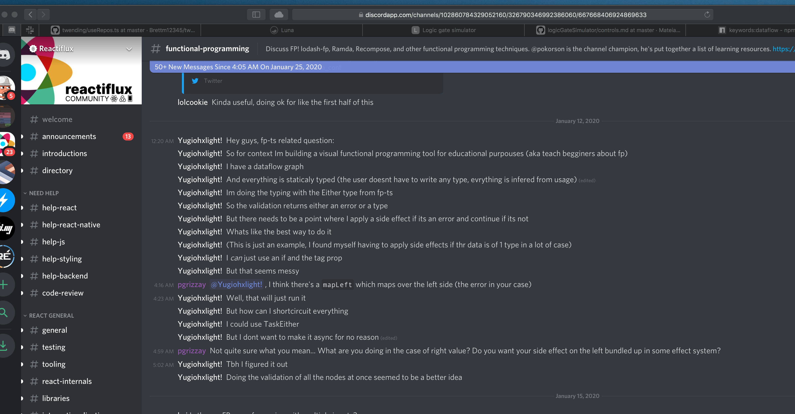
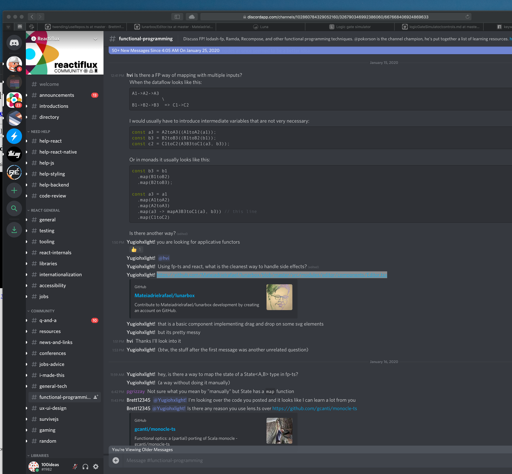
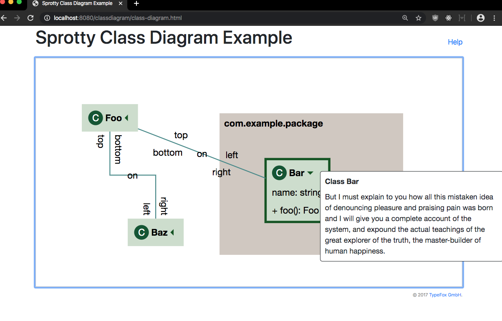
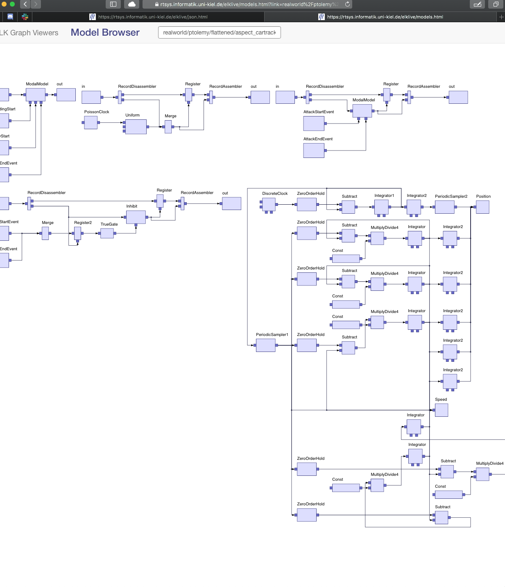
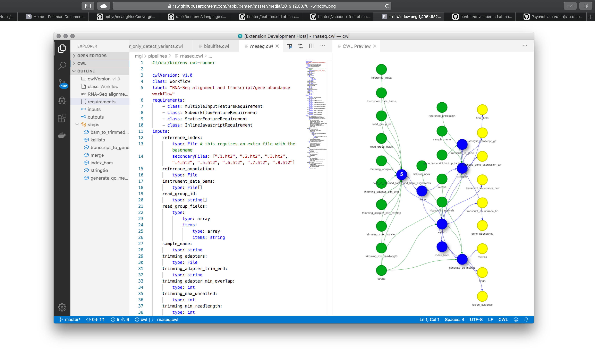

# 2020-02-12 dataflow with history notes


## ObservableHQ runtime

ObservableHQ ([blog post explainer](https://observablehq.com/@observablehq/how-observable-runs)) runtime package implements dependancy graph for js variables they call "modules": https://github.com/observablehq/runtime/blob/master/src/runtime.js#L79

```js 
function runtime_computeNow() {
  var queue = [],
      variables,
      variable;

  // Compute the reachability of the transitive closure of dirty variables.
  // Any newly-reachable variable must also be recomputed.
  // Any no-longer-reachable variable must be terminated.
  variables = new Set(this._dirty);
  variables.forEach(function(variable) {
    variable._inputs.forEach(variables.add, variables);
    const reachable = variable_reachable(variable);
    if (reachable > variable._reachable) {
      this._updates.add(variable);
    } else if (reachable < variable._reachable) {
      variable._invalidate();
    }
    variable._reachable = reachable;
  }, this);

  // Compute the transitive closure of updating, reachable variables.
  variables = new Set(this._updates);
  variables.forEach(function(variable) {
    if (variable._reachable) {
      variable._indegree = 0;
      variable._outputs.forEach(variables.add, variables);
    } else {
      variable._indegree = NaN;
      variables.delete(variable);
    }
  });

  this._computing = null;
  this._updates.clear();
  this._dirty.clear();

  // Compute the indegree of updating variables.
  variables.forEach(function(variable) {
    variable._outputs.forEach(variable_increment);
  });

  do {
    // Identify the root variables (those with no updating inputs).
    variables.forEach(function(variable) {
      if (variable._indegree === 0) {
        queue.push(variable);
      }
    });

    // Compute the variables in topological order.
    while (variable = queue.pop()) {
      variable_compute(variable);
      variable._outputs.forEach(postqueue);
      variables.delete(variable);
    }

    // Any remaining variables are circular, or depend on them.
    variables.forEach(function(variable) {
      if (variable_circular(variable)) {
        variable_error(variable, new RuntimeError("circular definition"));
        variable._outputs.forEach(variable_decrement);
        variables.delete(variable);
      }
    });
  } while (variables.size);

  function postqueue(variable) {
    if (--variable._indegree === 0) {
      queue.push(variable);
    }
  }
}

function variable_circular(variable) {
  const inputs = new Set(variable._inputs);
  for (const i of inputs) {
    if (i === variable) return true;
    i._inputs.forEach(inputs.add, inputs);
  }
  return false;
}

function variable_increment(variable) {
  ++variable._indegree;
}

function variable_decrement(variable) {
  --variable._indegree;
}

function variable_value(variable) {
  return variable._promise.catch(variable._rejector);
}

function variable_invalidator(variable) {
  return new Promise(function(resolve) {
    variable._invalidate = resolve;
  });
}

function variable_intersector(invalidation, variable) {
  let node = typeof IntersectionObserver === "function" && variable._observer && variable._observer._node;
  let visible = !node, resolve = noop, reject = noop, promise, observer;
  if (node) {
    observer = new IntersectionObserver(([entry]) => (visible = entry.isIntersecting) && (promise = null, resolve()));
    observer.observe(node);
    invalidation.then(() => (observer.disconnect(), observer = null, reject()));
  }
  return function(value) {
    if (visible) return Promise.resolve(value);
    if (!observer) return Promise.reject();
    if (!promise) promise = new Promise((y, n) => (resolve = y, reject = n));
    return promise.then(() => value);
  };
}
```

---

Me in [thi.ng discord chat](https://discordapp.com/channels/445761008837984256/445761258696736790) 2020-02-12:

> [3:32 PM]  100ideas: 
> Hi friends, has anyone ever seen a dataflow "engine" that was 
> 
> 1) able to reactively recompute based on atomic changes to any of its dependancies (yes), and 
> 2) maintained a history that mapped states of the graph + deps -> outputs? I'm interested in techniques for representing "forks"  and "merges" of the graph state ("program") and its outputs ("execution") at a granular level? 
> 
> I'm looking for examples, papers, discussions, and just plain old advice or hints regarding data structures and patterns that might be useful for #1+#2.  I've been reading up on event sourcing patterns and various CRDT theory & implementation trying to understand different ways complex graph-like systems can be forked & merged... but haven't settled on an approach yet.
> 
> [3:36 PM]  100ideas: 
> one use case: after setting up a computation graph w/ initial inputs, it runs and creates intermediate and final outputs. Now I want to play around with the graph and with the intermediate values speculatively to see (in new branches or versions of the execution) how the results change, then perhaps select some of those changes and make them permanent, discarding the others.
> 
> [3:58 PM]  100ideas: 
> @Yugiohxlight! coincidentally since you are working on a visual dataflow editor + execution engine (https://github.com/Mateiadrielrafael/lunarbox/blob/master/src/modules/dataflow/helpers/initGraph.ts) - I wonder if it is obvious to you how you might implement capturing history of the dataflow graph state + output, and also support forking/merging it...
> 

See `Yugiohxlight!` (on discord) / `Mateiadrielrafael` (github) - he's working on browser dataflow editor for teaching FP

https://github.com/Mateiadrielrafael/lunar
+ 
https://github.com/mateiadrielrafael-lunarbox

`dev/da-play/0_mock/2020-crdts/mateiadrielrafael-lunarbox`:
app installed, running development branch.
- needed to install `haskell` (`brew install haskell-stack`) to compile dev dependancy `purs-tsd-gen` for `mateiadrielrafael-lunarbox/packages/dataflow`.
- compiled it, then `cp ~/.local/bin/purs-tsd-gen node_modules/.bin/`
- then removed haskell (`brew rm haskell-stack`; `rm -rf ~/.stack`)


- https://github.com/Mateiadrielrafael/logicGateSimulator/blob/master/docs/tutorials/controls.md
- https://discordapp.com/channels/102860784329052160/326790346992386060/667668406924869633
- https://github.com/Mateiadrielrafael/lunarbox/blob/master/src/modules/editor/components/Editor.tsx




---

### Sprotty & ELK

https://github.com/eclipse/sprotty - A diagramming framework for the web
- https://github.com/eclipse/sprotty/wiki/Architectural-Overview

https://rtsys.informatik.uni-kiel.de/elklive/index.html




---

### CWL: Common Workflow Language

they have a monaco + python/ts language server for providing syntax highlighting & completions... even a graph! 

