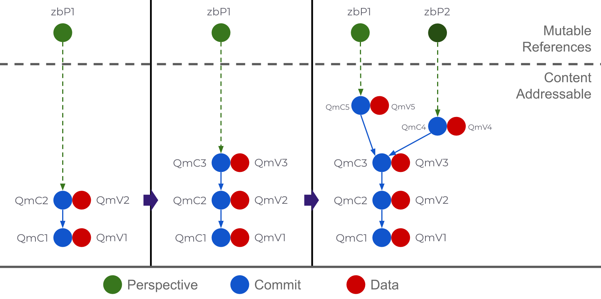
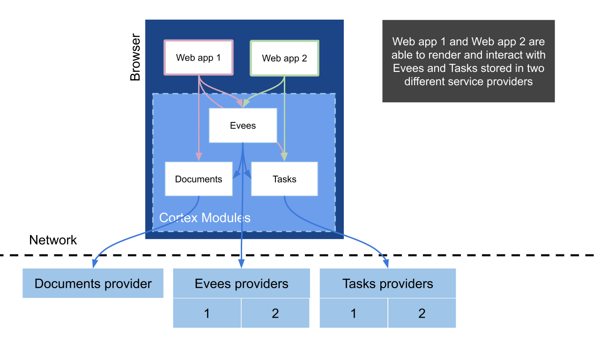
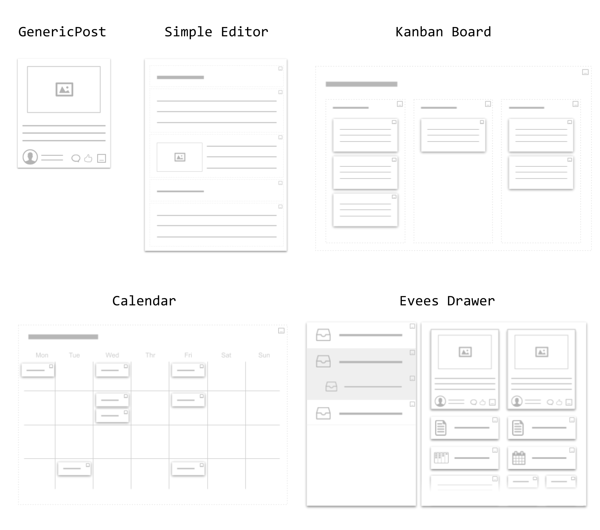

# 2020-02-13 ipfs notebook, workflow, fork-merge apps

----

upctrl:
https://github.com/uprtcl/spec

hyperknowledge: 
https://gitlab.com/hyperknowledge/hyperknowledge/blob/master/Readme.md

chat:
- https://app.woost.space/#page=5W4B6pA5yVDprYMkRyLuE1
- https://web.telegram.org/#/im?p=@knowledgegraphs

# underscore protocol AKA _Prtcl AKA upctrl
https://github.com/uprtcl/spec/blob/master/Readme.md
https://github.com/uprtcl/js-uprtcl/wiki

https://youtu.be/2AOIcIUy_3Q

## What is _Prtcl

_Prtcl is built on top of a few main pillars: Evees, the Cortex Framework, and Service Providers.

### Evees

Evees are like GIT repositories but their content is a JSON object, instead of a set of folders and files. Evees evolve as a sequence of content-addressable *Commits*, a sequence that might fork at a given Commit, creating more than one *head*. Each *head* of the sequence is referred to as a *Perspective* of the Evee.

Instead of working with objects, applications should work with *Perspectives* of an Evee. 

Perspectives are important because they enable parallel independent versions of an object to co-exist, instead of forcing all the applications and users of an object to interact with the same version, stepping on each other. They enable freedom and divergence while facilitating agreements and convergence.

Here is a diagram of an Evee, evolving as a sequence of commits, and passing from having one perspective (`zbP1`) to having two (`zbP1` and `zbP2`).

### Cortex Framework

Web applications and backend services are, usually, strongly coupled with the data structure of the objects they manipulate and fail at manipulating any other type of object. This prevents Evees from being interoperable among different apps. 

One challenge to achieving the _Prtcl vision is, therefore, to develop applications that can dynamically render and manipulate objects having different data structures. This needs to be achieved, however, without forcing strong restrictions on app developers about the type of data and operations they can perform on their apps.

This is what The Cortex Framework does. Its a generic framework for specifying frontend functionalities around *Entities* (data objects). With Cortex:

- One-object-multiple-apps (OOMA): One type of object is rendered and manipulated in different applications.
- One-app-multiple-objects (OAMO): One application is able to render and manipulate objects of different types. 

Cortex is built around the concept of patterns: a duck-type-like dynamic typing system that associates a given *behavior* to entities that fulfill a given *condition* on its data structure or value.

To learn more about Cortex see the [`js-uprtcl` documentation](https://github.com/uprtcl/js-uprtcl/wiki).

### Service Providers

Service Providers are the combination of a backend service and a frontend javascript class that, together, can perform a standard functionality, specified as an interface, for the rest of frontend modules. The backend service can be a web server, but can also be a decentralized network.

Web applications usually interact with a single backend service, but this will not be the case as applications start working with Evees that can reside on multiple platforms.

The following Evees Service Providers are being developed:

- [js-uprtcl](https://github.com/uprtcl/js-uprtcl): Includes a Local Service Provider, using the native browser indexedDB to store Evees.  
- [eth-uprtcl](https://github.com/uprtcl/eth-uprtcl): Store and govern Evees in Ethereum and IPFS.
- [js-uprtcl-server](https://github.com/uprtcl/js-uprtcl-server): Store and protect access to Evees in a NodeJS web REST API.
- [hc-uprtcl](https://github.com/uprtcl/hc-uprtcl): Store, govern and protect access to Evees in Holochain.

## The _Prtcl stack

The image below shows an example of how two _Prtcl compatible apps are structured (at a high level). 

OOMA: Both apps import the `Evees` and the `Tasks` Cortex Modules and, thus, let their users interact with "Task Evees". Tasks created in one app can be rendered, edited or forked on the other app.

OAMO: App 1 includes the Tasks and Documents modules, whose entities have a few *Patterns* in common (not shown in the figure). This way a Documents and a Task can be rendered together in say, a "list" area.

## _Prtcl Reusable Modules

A set of open-source _Prtcl Cortex modules is being developed. These modules **will soon be released** and will include web-components, state-management, patterns, and service providers to let developers integrate _Prtcl functionalities on their apps in a matter of minutes.

This is a list of the web-components from the modules that (will soon be) available:

- `GenericPost`: Bundles of text and images, similar to a Tweet or a Facebook post.
- `SimpleEditor`: Simple editor to write blog-posts or documents that can scale.
- `KanbanBoard`: Kanban board to organize cards in columns.
- `Calendar`: Calendar board to crate and display events.
- `Drawer`: A drawer to organize and store Evees.

This is how the web components listed above might look like:

These modules are especially well suited for web 3.0 applications in which user authentication and data storage is decentralized, but they can be used in web 2.0 applications using a Micro Services backend architecture.

## Where to go from here

To integrate a reusable Cortex module in your app see [`js-uprtcl` documentation](https://github.com/uprtcl/js-uprtcl/wiki).

---------------------

# IPFS camp 2019 - Knowledge Graphs and Underscore Protocol
https://github.com/ipfs/camp/blob/master/UNCONF/ipfscamp2019-unconf-knowledge-graphs_and_uprtcl.md

We combined both sessions because of common interests.

The topology of current internet platforms and infrastructure is constraining our capacity to grow as individuals and to advance as a collective. We are in a need for tools that can interoperate and allow us to organize, share, and fork knowledge transcending these limitations.

Prior to and through the camp, several of the participants had met already. There are quite a few projects tackling these issues from different perspectives.

## Participants

* Guillem Córdoba (@guillemcordoba) [_Prtcl](https://github.com/uprtcl)
* Vincent den Boer (@ShishKebab) WorldBrain and [Storex](https://github.com/worldBrain/storex)
* Akshay Kanthi (@aksanoble)
* Roman Khafizianov (@requilence)
* Justin Maire (@JustMaier)
* Jose Ospina (@pepoospina) [_Prtcl](https://github.com/uprtcl) and [CollectiveOne](http://www.collectiveone.org)
* Marc-Antoine Parent (@maparent) [hyperknowledge](https://hyperknoweldge.org)
* Anton Pronkin (@pronkin) [Anytype](https://www.anytype.io/)
* Oliver Sauter (@blackforestboi)  [WorldBrain](https://worldbrain.io/)
* Xavier Vives (@xavivives) [Interplanetary mind maps](https://github.com/interplanetarymindmap/mind-map)

## Unconf event

We were a large number of participants with a wide and abstract topic to cover. The timeframe of the event it barely gives us time to expose our personal perspective with a high level of abstraction.

We agreed that defining a data model is the hardest and more critical element to resolve, but to move forward we need to outline clear use-cases. We decided that a first step in this session was to brainstorm use cases that an interoperable data model for knowledge management data need to cover in order to work. The notes should provide ground for further discussion on how exactly a model could look like

So far we collected the following input: 
- Traceability > causality > sequence of actions (e.g. merge history)
- Flexibility in interpretation, aka. "views"
- Connect anything with anything. (e.g. with a graph)
- Ability to break or modify hierarchical social structures > fluidity 
- Hierarchy of context > local hierarchies
- Federation > [choral explanations](https://hapgood.us/2016/05/13/choral-explanations/)
- Deduplication, (local) merging and forking of arguments, ontologies, facts, reasonings and concepts. 
- Support for public and private sharing and encryption
- Extensible metadata, even as invisible payload
- Indexability & Searchability > ideally with different indexes
- Interoperability with existing standards 

We have created a [Telegram group](https://t.me/knowledgegraphs) to move the conversation forward.