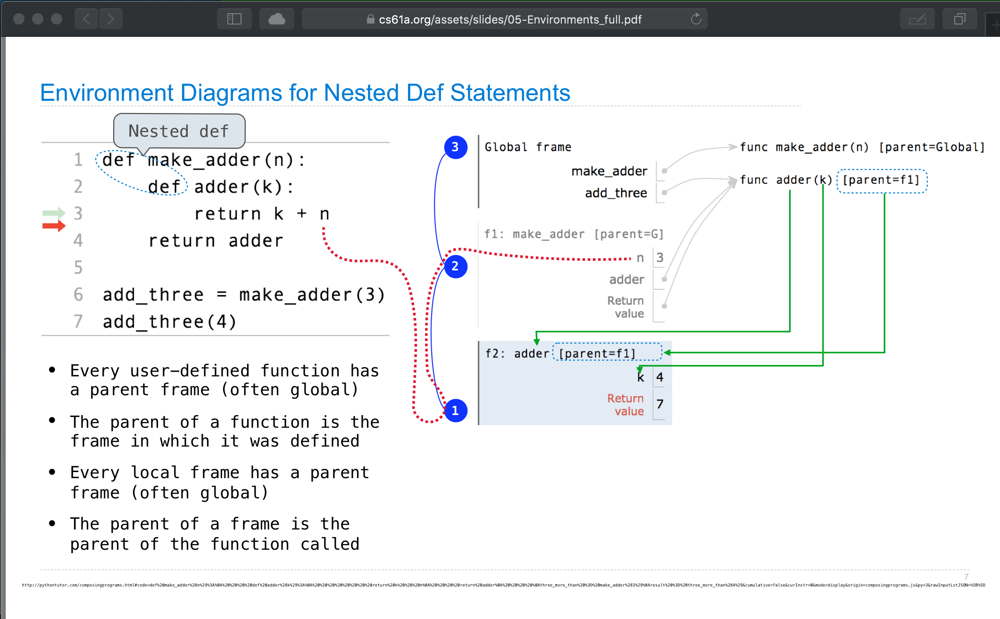
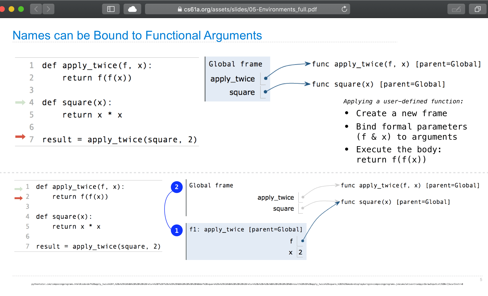

# notes: foundations of computational execution
- 2020-03-04: created


links
- composingprograms.com: excellent review from composingprograms.com course material.
  - scheme.py http://inst.eecs.berkeley.edu/~cs61a/fa13/proj/scheme/scheme.html
  - logic.py http://composingprograms.com/pages/45-unification.html#the-unification-algorithm
- albertwu.org TA or student of cs61a (composing programs)
- cs61a.org 
  - 2015 curriculum: https://inst.eecs.berkeley.edu/~cs61a/su15/
  - logic programming slides https://docs.google.com/presentation/d/1UQeqb496rhwwNmGY-82wJ63ag8FTbIOtKDYnEbGOfXc/edit?usp=sharing


## [Albert Wu cs61a notes - Environment Diagrams](http://albertwu.org/cs61a/notes/environments.html)

#### Frames
A **frame** keeps track of variable-to-value bindings. Every function call keeps track of its own set of bindings (e.g. it has its own **scope),** so every function call has a corresponding frame.

The **global frame,** or "Global" for short, is the starting frame. Global doesn't correspond to a specific function

Every frame except for Global has a **parent frame.** When function is called, its corresponding frame immediately has a parent — that parent is the frame in which that function was defined. When doing variable lookup, if you can't find a variable in the current frame, you look in its parent.

Frames might also have **frame numbers.** These numbers are used to label frames that are parents. If a frame is never a parent, it doesn't have to have a number.


---

## [ComposingPrograms 4.4: Logic Programming](http://composingprograms.com/pages/44-logic-programming.html#facts-and-queries)

> ### [4.5   Unification](http://composingprograms.com/pages/45-unification.html)
> 
> This section describes an implementation of the query interpreter that performs inference in the logic language. The interpreter is a general problem solver, but has substantial limitations on the scale and type of problems it can solve. More sophisticated logical programming languages exist, but the construction of efficient inference procedures remains an active research topic in computer science.
> 
> The fundamental operation performed by the query interpreter is called unification. Unification is a general method of matching a query to a fact, each of which may contain variables. The query interpreter applies this operation repeatedly, first to match the original query to conclusions of facts, and then to match the hypotheses of facts to other conclusions in the database. In doing so, the query interpreter performs a search through the space of all facts related to a query. If it finds a way to support that query with an assignment of values to variables, it returns that assignment as a successful result.
> 
> ...
>
> ### names & environments: 
> http://composingprograms.com/pages/12-elements-of-programming.html#names-and-the-environment
>
> "A critical aspect of a programming language is the means it provides for using *names* to refer to computational objects. If a value has been given a name, we say that the name binds to the value." 
>
> The = symbol is called the assignment operator in Python (and many other languages). Assignment is our simplest means of abstraction, for it allows us to use simple names to refer to the results of compound operations, such as the area computed above. In this way, complex programs are constructed by building, step by step, computational objects of increasing complexity.
>
> The possibility of binding names to values and later retrieving those values by name means that the interpreter must maintain some sort of memory that keeps track of the names, values, and bindings. This memory is called an environment.
>
> ...
>
> ### [4.5.3 Logic - The Unification Algorithm](http://composingprograms.com/pages/45-unification.html#the-unification-algorithm)
>
> Unification is a generalization of pattern matching that attempts to find a mapping between two expressions that may both contain variables. The unify function implements unification via a recursive process, which performs unification on corresponding parts of two expressions until a contradiction is reached or a viable binding to all variables can be established.
> 
> Let us begin with an example. The pattern (?x ?x) can match the pattern ((a ?y c) (a b ?z)) because there is an expression with no variables that matches both: ((a b c) (a b c)). Unification identifies this solution via the following steps:
> 
>   1. To match the first element of each pattern, the variable ?x is bound to the expression (a ?y c).
> 
>   2. To match the second element of each pattern, first the variable ?x is replaced by its value. Then, (a ?y c) is matched to (a b ?z) by binding ?y to b and ?z to c.
> 
> As a result, the bindings placed in the environment passed to unify contain entries for ?x, ?y, and ?z:
>
>    e = read_line("(?x ?x)")
>    f = read_line(" ((a ?y c) (a b ?z))")
>    env = Frame(None)
>    unify(e, f, env)
>    >>> True
>    
>    env.bindings
>    {'?z': 'c', '?y': 'b', '?x': Pair('a', Pair('?y', Pair('c', nil)))}
>
> The result of unification may bind a variable to an expression that also contains variables, as we see above with ?x bound to (a ?y c). The bind function recursively and repeatedly binds all variables to their values in an expression until no bound variables remain.
>
>    print(bind(e, env))
>      ((a b c) (a b c))
>
>In general, unification proceeds by checking several conditions. The implementation of unify directly follows the description below.
>
>  1. Both inputs e and f are replaced by their values if they are variables.
>  2. If e and f are equal, unification succeeds.
>  3. If e is a variable, unification succeeds and e is bound to f.
>  4. If f is a variable, unification succeeds and f is bound to e.
>  5. If neither is a variable, both are not lists, and they are not equal, then e and f cannot be unified, and so unification fails.
>  6. If none of these cases holds, then e and f are both pairs, and so unification is performed on both their first and second corresponding elements.
>
>     def unify(e, f, env):
>     """Destructively extend ENV so as to unify (make equal) e and f, returning True if this succeeds and False otherwise.  ENV may be modified in either case (its existing bindings are never changed)."""
>         e = lookup(e, env)
>         f = lookup(f, env)
>         if e == f:
>             return True
>         elif isvar(e):
>             env.define(e, f)
>             return True
>         elif isvar(f):
>             env.define(f, e)
>             return True
>         elif scheme_atomp(e) or scheme_atomp(f):
>             return False
>         else:
>            return unify(e.first, f.first, env) and unify(e.second, f.second, env)
>
> ### 4.5.5   Search
> 
> In order to establish a query from the facts already established in the system, the query interpreter performs a search in the space of all possible facts. Unification is the primitive operation that pattern matches two expressions. The search procedure in a query interpreter chooses what expressions to unify in order to find a set of facts that chain together to establishes the query.
> 
> The recursive search function implements the search procedure for the logic language. It takes as input the Scheme list of clauses in the query, an environment env containing current bindings of symbols to values (initially empty), and the depth of the chain of rules that have been chained together already.
> 
>     def search(clauses, env, depth):
>       """Search for an application of rules to establish all the CLAUSES, non-destructively extending the unifier ENV.  Limit the search to the nested application of DEPTH rules."""
>       if clauses is nil:
>           yield env
>       elif DEPTH_LIMIT is None or depth <= DEPTH_LIMIT:
>         if clauses.first.first in ('not', '~'):
>           clause = ground(clauses.first.second, env)
>           try:
>             next(search(clause, glob, 0))
>               except StopIteration:
>                 env_head = Frame(env)
>                 for result in search(clauses.second, env_head, depth+1):
>                   yield result
>         else:
>           for fact in facts:
>             fact = rename_variables(fact, get_unique_id())
>               env_head = Frame(env)
>               if unify(fact.first, clauses.first, env_head):
>                 for env_rule in search(fact.second, env_head, depth+1):
>                   for result in search(clauses.second, env_rule, depth+1):
>                     yield result
 
> The search to satisfy all clauses simultaneously begins with the first clause. In the special case where our first clause is negated, rather than trying to unify the first clause of the query with a fact, we check that there is no such unification possible through a recursive call to search. If this recursive call yields nothing, we continue the search process with the rest of our clauses. If unification is possible, we fail immediately.
> 
> If our first clause is not negated, then for each fact in the database, search attempts to unify the first clause of the fact with the first clause of the query. Unification is performed in a new environment env_head. As a side effect of unification, variables are bound to values in env_head.
> 
> If unification is successful, then the clause matches the conclusion of the current rule. The following for statement attempts to establish the hypotheses of the rule, so that the conclusion can be established. It is here that the hypotheses of a recursive rule would be passed recursively to search in order to be established.
> 
> Finally, for every successful search of fact.second, the resulting environment is bound to env_rule. Given these bindings of values to variables, the final for statement searches to establish the rest of the clauses in the initial query. Any successful result is returned via the inner yield statement.
> 
> Unique names. Unification assumes that no variable is shared among both e and f. However, we often reuse variable names in the facts and queries of the logic language. We would not like to confuse an ?x in one fact with an ?x in another; these variables are unrelated. To ensure that names are not confused, before a fact is passed into unify, its variable names are replaced by unique names using rename_variables by appending a unique integer for the fact.
> 
>     def rename_variables(expr, n):
>         """Rename all variables in EXPR with an identifier N."""
>         if isvar(expr):
>             return expr + '_' + str(n)
>         elif scheme_pairp(expr):
>             return Pair(rename_variables(expr.first, n),
>                         rename_variables(expr.second, n))
>         else:
>             return expr
>
> The remaining details, including the user interface to the logic language and the definition of various helper functions, appears in the logic example.


---


## model of evaluation
> http://composingprograms.com/pages/13-defining-new-functions.html#environments
>
> To evaluate a call expression whose operator names a user-defined function, the Python interpreter follows a computational process. As with any call expression, the interpreter evaluates the operator and operand expressions, and then applies the named function to the resulting arguments.
>
> An environment in which an expression is evaluated consists of a sequence of *frames*, depicted as boxes. Each frame contains *bindings*, each of which associates a name with its corresponding value. There is a single *global* frame. Assignment and import statements add entries to the first frame of the current environment. So far, our environment consists only of the global frame.
> 
> Applying a user-defined function introduces a second local frame, which is only accessible to that function. To apply a user-defined function to some arguments:
>
>   1. Bind the arguments to the names of the function's formal parameters in a new local frame.
>   2. Execute the body of the function in the environment that starts with this frame.
>
> The environment in which the body is evaluated consists of two frames: first the local frame that contains formal parameter bindings, then the global frame that contains everything else. Each instance of a function application has its own independent local frame.
>
> The order of frames in an environment affects the value returned by looking up a name in an expression. We stated previously that a name is evaluated to the value associated with that name in the current environment. We can now be more precise:
>
> The "Return value" in the square() frame is not a name binding; instead it indicates the value returned by the function call that created the frame.
>
> **Our conceptual framework of environments, names, and functions** constitutes **a model of evaluation**; while some mechanical details are still unspecified (e.g., how a binding is implemented), our model does precisely and correctly describe how the interpreter evaluates call expressions. In Chapter 3 we will see how this model can serve as a blueprint for implementing a working interpreter for a programming language.

## 2.4.6   The Cost of Non-Local Assignment
> It is not unusual for two names to co-refer to the same value in the world, and so it is in our programs. But, as values change over time, we must be very careful to understand the effect of a change on other names that might refer to those values.
> 
> The key to correctly analyzing code with non-local assignment is to remember that only function calls can introduce new frames. Assignment statements always change bindings in existing frames. In this case, unless make_withdraw is called twice, there can be only one binding for balance.
> 
> Sameness and change. These subtleties arise because, by introducing non-pure functions that change the non-local environment, we have changed the nature of expressions. An expression that contains only pure function calls is referentially transparent; its value does not change if we substitute one of its subexpression with the value of that subexpression.
> 
> Re-binding operations violate the conditions of referential transparency because they do more than return a value; they change the environment. When we introduce arbitrary re-binding, we encounter a thorny epistemological issue: what it means for two values to be the same. In our environment model of computation, two separately defined functions are not the same, because changes to one may not be reflected in the other.


---


> ## [2.5.3   Message Passing and Dot Expressions](https://composingprograms.com/versions/v1/pages/25-object-oriented-programming.html#message-passing-and-dot-expressions)
> 
> Methods, which are defined in classes, and instance attributes, which are typically assigned in constructors, are the fundamental elements of object-oriented programming. These two concepts replicate much of the behavior of a dispatch dictionary in a message passing implementation of a data value. Objects take messages using dot notation, but instead of those messages being arbitrary string-valued keys, they are names local to a class. Objects also have named local state values (the instance attributes), but that state can be accessed and manipulated using dot notation, without having to employ nonlocal statements in the implementation.
> 
> The central idea in message passing was that data values should have behavior by responding to messages that are relevant to the abstract type they represent. Dot notation is a syntactic feature of Python that formalizes the message passing metaphor. The advantage of using a language with a built-in object system is that message passing can interact seamlessly with other language features, such as assignment statements. We do not require different messages to "get" or "set" the value associated with a local attribute name; the language syntax allows us to use the message name directly.
> 
> Dot expressions. The code fragment tom_account.deposit is called a dot expression. A dot expression consists of an expression, a dot, and a name:
> 
> <expression> . <name>
> 
> The `<expression>` can be any valid Python expression, but the `<name>` must be a simple name (not an expression that evaluates to a name). A dot expression evaluates to the value of the attribute with the given `<name>`, for the object that is the value of the `<expression>`.
> 
> The built-in function getattr also returns an attribute for an object by name. It is the function equivalent of dot notation. Using getattr, we can look up an attribute using a string, just as we did with a dispatch dictionary.
> 
> >>> getattr(tom_account, 'balance')
> 10
> 
> We can also test whether an object has a named attribute with hasattr.
> 
> >>> hasattr(tom_account, 'deposit')
> True
> 
> The attributes of an object include all of its instance attributes, along with all of the attributes (including methods) defined in its class. Methods are attributes of the class that require special handling.
> 
> Methods and functions. When a method is invoked on an object, that object is implicitly passed as the first argument to the method. That is, the object that is the value of the `<expression>` to the left of the dot is passed automatically as the first argument to the method named on the right side of the dot expression. As a result, the object is bound to the parameter self.
> 
> To achieve automatic self binding, Python distinguishes between functions, which we have been creating since the beginning of the text, and bound methods, which couple together a function and the object on which that method will be invoked. A bound method value is already associated with its first argument, the instance on which it was invoked, which will be named self when the method is called.
> 
> We can see the difference in the interactive interpreter by calling type on the returned values of dot expressions. As an attribute of a class, a method is just a function, but as an attribute of an instance, it is a bound method.
>
> ...
>
> In order to implement objects, we will abandon dot notation (which does require built-in language support), but create dispatch dictionaries that behave in much the same way as the elements of the built-in object system. We have already seen how to implement message-passing behavior through dispatch dictionaries. To implement an object system in full, we send messages between instances, classes, and base classes, all of which are dictionaries that contain attributes.
> 
## [2.6   Implementing Classes and Objects](https://composingprograms.com/versions/v1/pages/26-implementing-classes-and-objects.html)
> 
> ### 2.6.1   Instances
> 
> We begin with instances. An instance has named attributes, such as the balance of an account, which can be set and retrieved. We implement an instance using a dispatch dictionary that responds to messages that "get" and "set" attribute values. Attributes themselves are stored in a local dictionary called attributes.
>
> As we have seen previously in this chapter, dictionaries themselves are abstract data types. We implemented dictionaries with lists, we implemented lists with pairs, and we implemented pairs with functions. As we implement an object system in terms of dictionaries, keep in mind that we could just as well be implementing objects using functions alone.
> 
> 
> To begin our implementation, we assume that we have a class implementation that can look up any names that are not part of the instance. We pass in a class to make_instance as the parameter cls.
> 
> 
>      >>> def make_instance(cls):
>          """Return a new object instance, which is a dispatch dictionary."""
>          def get_value(name):
>              if name in attributes:
>                  return attributes[name]
>              else:
>                  value = cls['get'](name)
>                  return bind_method(value, instance)
>          def set_value(name, value):
>              attributes[name] = value
>          attributes = {}
>          instance = {'get': get_value, 'set': set_value}
>          return instance
>       
>
> The instance is a dispatch dictionary that responds to the messages get and set. The set message corresponds to attribute assignment in Python's object system: all assigned attributes are stored directly within the object's local attribute dictionary. In get, if name does not appear in the local attributes dictionary, then it is looked up in the class. If the value returned by cls is a function, it must be bound to the instance.
>
> Bound method values. The get_value function in make_instance finds a named attribute in its class with get, then calls bind_method. Binding a method only applies to function values, and it creates a bound method value from a function value by inserting the instance as the first argument:
>
>    def bind_method(value, instance):
>        """Return a bound method if value is callable, or value otherwise."""
>        if callable(value):
>            def method(*args):
>                return value(instance, *args)
>            return method
>        else:
>            return value
>
> When a method is called, the first parameter self will be bound to the value of instance by this definition.
>
> ### 2.6.2   Classes
> 
> A class is also an object, both in Python's object system and the system we are implementing here. For simplicity, we say that classes do not themselves have a class. (In Python, classes do have classes; almost all classes share the same class, called type.) A class can respond to get and set messages, as well as the new message:
>
>    def make_class(attributes, base_class=None):
>        """Return a new class, which is a dispatch dictionary."""
>        def get_value(name):
>            if name in attributes:
>                return attributes[name]
>            elif base_class is not None:
>                return base_class['get'](name)
>        def set_value(name, value):
>            attributes[name] = value
>        def new(*args):
>            return init_instance(cls, *args)
>        cls = {'get': get_value, 'set': set_value, 'new': new}
>        return cls
> 
> Unlike an instance, the get function for classes does not query its class when an attribute is not found, but instead queries its base_class. No method binding is required for classes.
> 
> Initialization. The new function in make_class calls init_instance, which first makes a new instance, then invokes a method called __init__.
>
>    def init_instance(cls, *args):
>        """Return a new object with type cls, initialized with args."""
>        instance = make_instance(cls)
>        init = cls['get']('__init__')
>        if init:
>            init(instance, *args)
>        return instance
>
> This final function completes our object system. We now have instances, which set locally but fall back to their classes on get. After an instance looks up a name in its class, it binds itself to function values to create methods. Finally, classes can create new instances, and they apply their __init__ constructor function immediately after instance creation.
>
> In this object system, the only function that should be called by the user is make_class. All other functionality is enabled through message passing. Similarly, Python's object system is invoked via the class statement, and all of its other functionality is enabled through dot expressions and calls to classes.


---

> ## How to Draw an Environment Diagram
> When a function is defined:
>   1. Create a function value:   `func <name>(<formal parameters>) [parent=<label>]`
>   2. Its parent is the current frame.
>     
>           v----------------------------------------v
>           f1: make_adder       nc adder(k) [parent=f1]
>
>   3. Bind <name> to the function value in the current frame>
>
> When a function is called:
>   1. Add a local frame, titled with the <name> of the function being called.
>   2. Copy the parent of the function to the local frame: [parent=<label>]
>   3. Bind the <formal parameters> to the arguments in the local frame. 
>   4. Execute the body of the function in the environment that starts with the local frame.
> >
> 
>
> 


---
> ## 3.5   Interpreters for Languages with Abstraction
> 
> http://composingprograms.com/pages/35-interpreters-for-languages-with-abstraction.html#structure
> 
> This section describes the general structure of a Scheme interpreter. Completing that project will produce a working implementation of the interpreter described here.
> 
> An interpreter for Scheme can share much of the same structure as the Calculator interpreter. A parser produces an expression that is interpreted by an evaluator. The evaluation function inspects the form of an expression, and for call expressions it calls a function to apply a procedure to some arguments. Much of the difference in evaluators is associated with special forms, user-defined functions, and implementing the environment model of computation.
> 
> **Parsing.** The scheme_reader and scheme_tokens modules from the Calculator interpreter are nearly sufficient to parse any valid Scheme expression. However, it does not yet support quotation or dotted lists. A full Scheme interpreter should be able to parse the following input expression.
```scheme
>>> read_line("(car '(1 . 2))")
  Pair('car', Pair(Pair('quote', Pair(Pair(1, 2), nil)), nil))
```
Your first task in implementing the Scheme interpreter will be to extend scheme_reader to correctly parse dotted lists and quotation.

**Evaluation.** Scheme is evaluated one expression at a time. A skeleton implementation of the evaluator is defined in scheme.py of the companion project. Each expression returned from scheme_read is passed to the `scheme_eval` function, which evaluates an expression expr in the current environment env.

The ``scheme_eval`` function evaluates the different forms of expressions in Scheme: primitives, special forms, and call expressions. The form of a combination in Scheme can be determined by inspecting its first element. Each special form has its own evaluation rule. A simplified implementation of `scheme_eval` appears below. Some error checking and special form handling has been removed in order to focus our discussion. A complete implementation appears in the companion project.

```scheme
>>> def scheme_eval(expr, env):
        """Evaluate Scheme expression expr in environment env."""
        if scheme_symbolp(expr):
            return env[expr]
        elif scheme_atomp(expr):
            return expr
        first, rest = expr.first, expr.second
        if first == "lambda":
            return do_lambda_form(rest, env)
        elif first == "define":
            do_define_form(rest, env)
            return None
        else:
            procedure = scheme_eval(first, env)
            args = rest.map(lambda operand: scheme_eval(operand, env))
            return scheme_apply(procedure, args, env)
```

**Procedure application.** The final case above invokes a second process, procedure application, that is implemented by the function scheme_apply. The procedure application process in Scheme is considerably more general than the calc_apply function in Calculator. It applies two kinds of arguments: a PrimtiveProcedure or a LambdaProcedure. A PrimitiveProcedure is implemented in Python; it has an instance attribute fn that is bound to a Python function. In addition, it may or may not require access to the current environment. This Python function is called whenever the procedure is applied.

A LambdaProcedure is implemented in Scheme. It has a body attribute that is a Scheme expression, evaluated whenever the procedure is applied. *To apply the procedure to a list of arguments, the body expression is evaluated in a new environment. To construct this environment, a new frame is added to the environment, in which the formal parameters of the procedure are bound to the arguments. The body is evaluated using scheme_eval.*

**Eval/apply recursion.** The functions that implement the evaluation process, scheme_eval and scheme_apply, are mutually recursive. Evaluation requires application whenever a call expression is encountered. Application uses evaluation to evaluate operand expressions into arguments, as well as to evaluate the body of user-defined procedures. The general structure of this mutually recursive process appears in interpreters quite generally: evaluation is defined in terms of application and application is defined in terms of evaluation.

This recursive cycle ends with language primitives. Evaluation has a base case that is evaluating a primitive expression. Some special forms also constitute base cases without recursive calls. Function application has a base case that is applying a primitive procedure. *This mutually recursive structure, between an eval function that processes expression forms and an apply function that processes functions and their arguments, constitutes the essence of the evaluation process.*

3.5.2   Environments

Now that we have described the structure of our Scheme interpreter, we turn to implementing the **Frame** class that forms environments. Each **Frame** instance represents an environment in which symbols are bound to values. A frame has a dictionary of bindings, as well as a parent frame that is None for the global frame.

*Bindings are not accessed directly, but instead through two Frame methods: lookup and define.* The first implements the look-up procedure of the environment model of computation described in Chapter 1. A symbol is matched against the bindings of the current frame. If it is found, the value to which it is bound is returned. If it is not found, look-up proceeds to the parent frame. On the other hand, the define method always binds a symbol to a value in the current frame.

The implementation of lookup and the use of define are left as exercises. As an illustration of their use, consider the following example Scheme program:

```scheme
(define (factorial n)
  (if (= n 0) 1 (* n (factorial (- n 1)))))

(factorial 5)
120
```

The first input expression is a **define** special form, evaluated by the **do_define_form** Python function. Defining a function has several steps:

1. Check the format of the expression to ensure that it is a well-formed Scheme list with at least two elements following the keyword **define.**

2. Analyze the first element, in this case a **Pair,** to find the function name **factorial** and formal parameter list **(n).**

3. Create a **LambdaProcedure** with the supplied formal parameters, body, and parent environment.

4. Bind the symbol **factorial** to this function, in the first frame of the current environment. In this case, the environment consists only of the global frame.

The second input is a call expression. The **procedure** passed to **scheme_apply** is the **LambdaProcedure** just created and bound to the symbol **factorial.** The args passed is a one-element Scheme list **(5).** To apply the procedure, a new frame is created that extends the global frame (the parent environment of the **factorial** procedure). In this frame, the symbol n is bound to the value 5. Then, the body of **factorial** is evaluated in that environment, and its value is returned.

