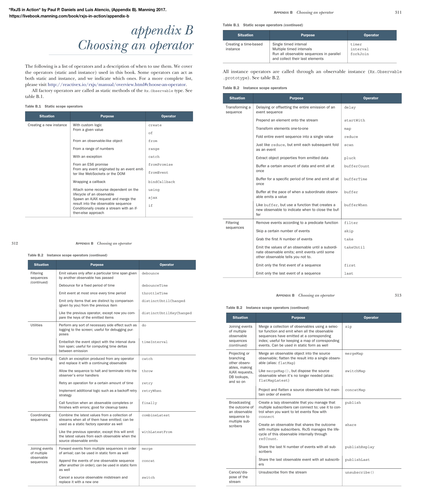

# @thi.ng documentation suggestions - 4 March 2020 

https://discordapp.com/channels/445761008837984256/445761258696736790/684688980176011292

1:09 AM 100ideas: @toxi#8381 I've been working my way through the source code, docs, and examples for transducers, rstream, & hdom. it's been challenging for me because I am not fluent with lisp/clojure FP patterns (if it were a spoken language, I would say I could read but not speak conversationaly). But that's ok, I'm really digging what I'm learning; the code can be so elegant and minimal, it's beautiful :thumbsup: 

I just got a copy of "Structure & Interpretation of Computer Programs" and I'm finding it highly relevant. I also just skimmed through "RxJS in Action" to get a sense for the fundamental concepts & similarities in usage patterns shared between @thi.ng stream-and-transformation processing packages and RxJs.

I have three suggestions:

1) Tool Name -> Archetypal Use Case table
2) Learning FP README section + link to SICP
3) reimplement SICP examples w/ @thi.ng tools

*1) Tool Name -> Archetypal Use Case table*:       There is a useful chart at the end of RxJS, "Appendix B: Choosing and operator". It lists the purpose and name of a bunch of operators - see image. I know the transducers README already lists them all with a short description, but even after reading the README, auto-api docs, and tsdoc src comments, I still lacked a basic intuition about what the most common use case was for most of the transducers that are available. My lack of knowledge is my own weakness, not the responsibility of @thi.ng docs per se, so please take this as a suggestion about how to make something great (thi.ng/\*) even better and not as a criticism.

RxJS in Action, Daniels, 2017, Appendix B: "The following is a list of operators and a description of when to use them. We cover the operators (static and instance) used in this book. Some operators can act as both static and instance, and we indicate which ones."

I really like the list from RxJS Appendix B - it is like codified intuition, a conceptual roadmap. I suggest adding a similar list to the transducer docs/readme, or an empty table or template where it could eventually be collected (maybe the table could be constructed from a particular jsdoc comment for each tx function... `/** @conceptual_defn: "use <fn_name> when you are <situation/usecase category X>, with/so that/from < purpose Y>, unless <Z> */` ) "this Tool (transducer) is Named X, and you will want it when you have a problem/goal like Y or Z" for @thi.ng/transducers would help programmers new to FP stream processing get up to speed more quickly.

*2) Learning FP README section + link to SICP:*       I encourage you to add a link to the online version of "Structure and Interpretation of Computer Programs" somewhere in the main Readme - maybe in a "learning functional programming with @thi.ng toolchain" type section. https://web.mit.edu/alexmv/6.037/sicp.pdf Also, the online website for Berkeley's"Structure and Interpretation of Computer Programs" class looks good too (just saw it) https://cs61a.org.

*3) reimplement SICP examples*:       I've only skimmed 1/3 or so of the SICP book so far and have skipped all the exercises - for now. It would be a fun and instructive project (for me, or anyone else interested) to reimplement some of the exercises with @thi.ng tools in JS/TS. These could form additional examples in the documentation section of the repo and would additionally benefit from the preexisting theory and discussion in the textbook for those looking to learn the fundamentals. If this sounds like a worthwhile idea, I'd like feedback (from all) about which exercises/examples from the book would make nice initial additions to the @thi.ng docs. If there's interest I'll set up a collaborative repo to consolidate submissions (we should have prizes :slight_smile:

