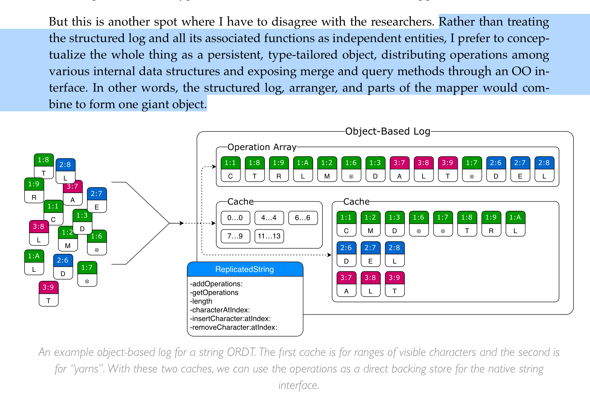
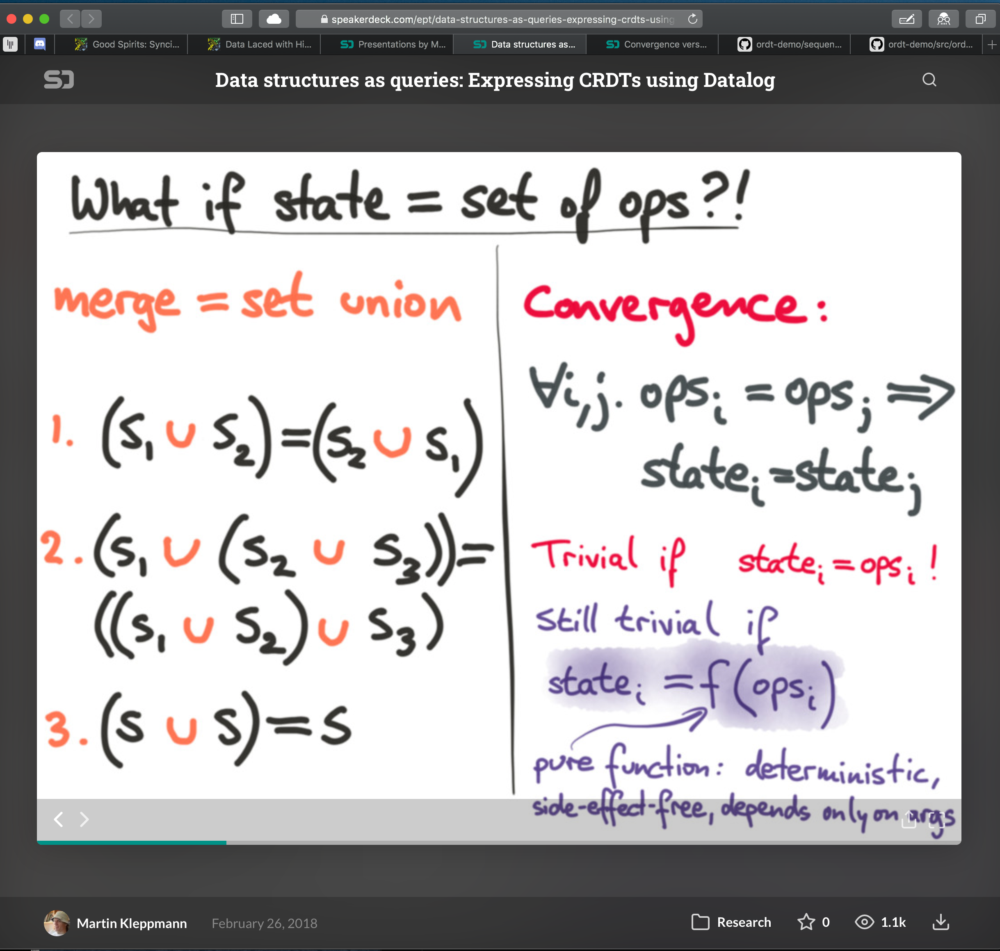

## 04 Feb 2020 - notes on designing causal tree

IDs must support partial order of all nodes. For CRDTs, "A join semi-lattice is an order <S,≤> for which there exists a join `x ∨ y` for any `x,y ∈ S`."

CRDT / CT needs to take atom, or weave of atoms, and `merge` them with existing tree. How are concurrent changes hangled? (LWW) last-write-win? something else?

for all node types in CT, `merge` must support: 
- idempotence: : `a∨a=a`
- commutativity: `a ∨ b = b ∨ a`
- associativity: `(a∨b)∨c=a∨(b∨c)`

design principles: 

- CT nodes should be stored in an efficient linear data structure (preorder depth-first reverse-chronological timestamp sorted: the "weave"). 
- new/incoming nodes may require re-sorting the site's weave.
- operations should ideally be pure and meet the three constraints above
- Thinking of **`row`** (aka `entity`, a POJO of keys + values) as the atomic unit operated on by ops
- **tables** (aka `agg` aka `cxn`) as containers of rows
- ```json
  node S1@t1: {"op": "create_row",   "payload": rowdata-1 } // row uuid = "S1@T1"
  node S1@t2: {"op": "create_spec",  "payload": spec-1 }
  node S1@t3: {"op": "create_table", "payload": {meta: tablemeta}}
  node S1@t4: {"op": "table-update", "payload": ["S1@T1", "row-UUID-2", "S1@t2"]}
  ```
- want rows to have uuid that can be used to indicate membership in multiple tables, i.e. foreign key;
  - want mobx collection materialized reactive view of CT objects by uuid from weave cache, at *head* (latest version, default), or by timestamp. useful for UI 
  - want materialized value to recompute automatically (mobx) based on users selections, if any. I.e. if upstream `block` "`b-uuid-s1@t5`" is selected, all displayed tables/rows/entities `uuid-s1@tx` should update such that their timestamp `tx <= max_timestamp( selection.children)`, i.e. views should gray-out elements caused by nodes outside of / downstream of the `weft` containing the selection's children.
  - confused for now about how to represent **parent** relationship for rows...
  - check out how automerge does linking:
    >`{ action: 'link', obj: objectId, key: key, value: objectId }`
    >
    > The user took a previously created map (created with `makeMap`) or list object (created with `makeList`), and made it a nested object within another map or list. Put another way, this operation creates a reference or pointer from one object to another. It is acceptable for the same object to be referenced from several different places in a document. In principle, you could also create reference cycles, but the code currently doesn't handle them, so you'll get infinite loops. 
    > 
    > `obj` is the UUID of the map or list being modified (i.e. the outer map or list in the nesting). `key` is the name of the field (in the case of `obj` being a map) or the ID of the list element (if `obj` is a list) being updated. `value` is the UUID of the object being referenced (i.e. the nested map or list).
    > https://github.com/automerge/automerge/blob/master/frontend/table.js


Archagon's wisdom:
> In CT parlance, the operation structs that make up the tree are called **atoms**. Each atom has a unique **identifier** comprised of a **site UUID**, **index**, and **Lamport timestamp**
> 
> The index and timestamp serve the same role of logical clock, and the data structure could be made to work with one or the other in isolation. *(The reason to have both is to enable certain optimizations: the index for O(1) atom lookups by identifier, and the timestamp for O(1) causality queries between atoms.)*
>
> The heart of an atom is its **value**, which defines the behavior of the operation and stores any relevant data. (i.e. Insert operations store a new character to place, while delete operations contain no extra data.) An atom also stores the identifier of its **cause**, or parent, atom.
> 
> For convenience, a CT begins with a “zero” root atom, and the ancestry of each subsequent atom can ultimately be traced back to it. 
>
> *The depth-first, preorder traversal of our operational tree is called a* **weave**, equivalent to the operational array discussed earlier. Instead of representing the tree as an inefficient tangle of pointers, we store it in memory as this weave array. 
>
> Additionally, since we know the creation order of each atom on every site by way of its timestamp (and since a CT is not allowed to contain any causal gaps), we can always derive a particular site’s exact sequence of operations from the beginning of time. *This sequence of site-specific atoms in creation order is called a* **yarn**. 
>
> Yarns are more of a cache than a primary data structure in a CT, but I keep them around together with the weave to enable O(1) atom lookups. To pull up an atom based on its identifier, all you have to do is grab its site’s yarn array and read out the atom at the identifier’s index.
> 
> *One more data structure to note is a collection of site+timestamp pairs called a* **weft**, which is simply a fancy name for a version vector. You can think of this as a filter on the tree by way of a cut across yarns: one in which only the atoms with a timestamp less than or equal to their site’s timestamp in the weft are included. Wefts can uniquely identify and split the CT at any point in its mutation timeline, making them very useful for features such as garbage collection and past revision viewing.
> ...
> 
> *The arranger/**reducer**/effect and the **mapper**/eval functions together form the two halves of the ORDT: one dealing with the memory layout of data, the other with its user-facing interpretation*
> 
> ...
>
> In both cases, operational storage is generic without any type-specific code. Everything custom about a particular data type is handled in the reducer/effect and mapper/eval functions.
> 
> But this is another spot where I have to disagree with the researchers. Rather than treating the structured log and all its associated functions as independent entities, I prefer to conceptualize the whole thing as a persistent, type-tailored object, distributing operations among various internal data structures and exposing merge and query methods through an OO interface. In other words, the structured log, arranger, and parts of the mapper would combine to form one giant object. 
>
> 
>
> Here are some basic rules I’ve come up with for this process:
> 
> - The operations are the data. Define and organize your operations so that you can query the ORDT directly without having to actually execute the operations first. Start with the regular data structure and figure out the best way to divide it into atomic units while keeping the skeleton intact. Then, try to find a way to inject any additional operations you might need into that same structure. Always remember that you’re not dealing with data or events, but both at the same time. Not every data type will be susceptible to atomization, but many will be.
> 
> -Be sure to define your operations in absolute terms, with no implicit context. Causal links to other operations should provide all the context you need. Recall the issues caused by poorly-specified string index operations!
> 
> - As much as possible, avoid operations that have non-local effects, multiple causes, or that may affect multiple future operations. (Good operation: insert letter after letter. Bad operation: reverse string.) Operations that behave more like events than data are an anti-pattern. There has to be a degree of symmetry between the operations and their effect on the data structure. Allow the location ID (or “cause”) of your operations to guide the design and weave your data structure together.
> 
> - Always keep in mind the essential functions: initialization, merge and operation integration, garbage collection, serialization and deserialization. Filtering by weft is worth considering, too. Nothing should be slower than O(nlogn).
> 
> - If garbage collection is to be used, ensure that only operations causally preceding and concurrent to any delete-type operation could possibly be affected by its compaction—none afterwards. In other words, once a site has received a command that’s intended to remove data, make sure that new commands can’t be generated that reference the deleted portion of the ORDT.
> 
> - If using the object-based approach, ensure that each operation only exists in a single internal data structure at a time. Don’t rely on incidental state such as insertion order; keep your internal data structures organized, sorted, and balanced at all times. Avoid moving operations between internal data structures. Instead of thinking of your object as having state, treat it as an organizational framework for your immutable operations. Try to ensure that the object will look the same even if recreated from scratch using the same set of operations.
> 
> - One exception: caches of operations might be needed for optimal performance in some scenarios. (For example, yarns in a CT.) If you have caches, make absolutely, 100% sure that they’re consistent following all mutating operations; that they’re never serialized; and that it’s always possible to efficiently recreate them on initialization and deserialization. Caches are one of the easiest ways to corrupt your data!
> 
> #### Representing Non-String Objects
> 
> **To implement a custom data type as a CT, you first have to “atomize” it, or decompose it into a set of basic operations, then figure out how to link those operations such that a mostly linear traversal of the CT will produce your output data.** (In other words, make the structure analogous to a one- or two-pass parsable format.)
> 
> In the demo section, I presented a CT designed for Bézier drawing. 
>
> In essence, this particular CT consists of a bunch of superimposed ORDTs: sequences for shapes and points, LWW registers for attributes, and a kind of counter for transformations. Here’s how I coded the value enum for each atom:
>  
```swift
enum DrawDatum: CausalTreeValueT, CausalTreePrioritizable
{    
    case null // no-op for grouping other atoms
    case shape
    case point(pos: NSPoint)
    case pointSentinelStart
    case pointSentinelEnd
    case trTranslate(delta: NSPoint, ref: AtomId)
    case attrColor(ColorTuple)
    case attrRound(Bool)
    case delete

    var priority: Bool
    {
        switch self
        {
        case .null:
            return true
        case .shape:
            return false
        case .point:
            return false
        case .pointSentinelStart:
            return false
        case .pointSentinelEnd:
            return false
        case .trTranslate:
            return true
        case .attrColor:
            return true
        case .attrRound:
            return true
        case .delete:
            return true
        }
    }

    mutating func remapIndices(_ map: [SiteId:SiteId])
    {
        switch self
        {
        case .trTranslate(let delta, let ref):
            if let newSite = map[ref.site]
            {
                self = .trTranslate(delta: delta, ref: AtomId(site: newSite, index: ref.index))
            }
        default:
            break
        }
    }
    // insert Codable boilerplate here
}

typealias DrawAtom = Atom<DrawDatum>
```
> 
> (http://archagon.net/blog/2018/03/24/data-laced-with-history/)




additionally, `ops` defined in CT `nodes` should be pure? / no side effects? hmmm.


CT (aka RGA crdt type) operations, datalog style 

- github.com/courajs/ordt-demo/blob/master/src/ordts/sequence.js **ORDT in JS! refs archagon CT**
- github.com/peer-base/js-delta-crdts
- www.youtube.com/watch?v=Cn9pIX8BWIU
- speakerdeck.com/ept/data-structures-as-queries-expressing-crdts-using-datalog?slide=9
- jtfmumm.com/blog/2015/11/17/crdt-primer-1-defanging-order-theory

## 31 Jan 2020

playing around with mocks for block oplog structure

```json
/****************************************************************
 *  entity -> CT addressing scheme                              *
 *                                                              *
 *          |--------------------------site uuid shortcut       *
 *          |   -----------------------namespace                *
 *          |   |     |----------------parent uuid              *
 *          |   |     |    |-----------parent change index      *
 *          |   |     |    |   |-------entity uuid              *
 *          |   |     |    |   |    |--global lamport timestamp *
 *          v   v     v    v   v    v                    *******/
{ "outs": ["@/files/xvzop8-3-ay2cie-1"] }
```

```json
// oplog "in" block
[
  { // 1st draft
     "op":    "@/file/upload",
    "ins":   ["@/uilog/xvzop8/2/qly6no/2"],
   "uuid":    "@/oplog/xvzop8-3-n51qmi-7",
   "outs":   ["@/files/xvzop8-4-ay2cie-3"],
   "desc":    "user uploaded 'isbns.csv' into Block 1",
  "block":    "@/block/0/xvzop8-1"       // redundant? in uuid...
    //           ^     ^    ^   ^
    //          ns/lamport/uuid-local_update_index
  },
  { // 2nd draft
     "op":    "@/file/upload",  //    or maybe  "@/storage/upload"  
    "ins":   ["U-2-qly6no"],    // U: uilog
   "uuid":    "O-3-n51qmi",     // O: oplog
   "outs":   ["S-4-ay2cie"],    // S: storage
   "desc":    "user uploaded 'ay2cie#isbns.csv' into Block 1",,
  "block":    "B-xvzop8-1",     // B: block
    //      v--^   |    ^----|
    //     ns     uuid?    lamport 
  },
  {
     "op":    "@/file/parse/csv",
    "ins":   ["S-4-ay2cie"],   // S: storage
   "uuid":    "O-5-irc9xu",
   "outs":   ["V-6-oipkk9"],   // V: values  (or maybe D: for data?)
   "desc":    "parsed 'isbns.csv/oipkk9' into KV store",,
  "block":    "xvzop8-1",      // ??? always points to containing block or frame?
  },
  {
     "op":    "@/frame/create",
    "ins":   ["V-6-oipkk9"],   // V: values; // value sets referenced in array will be logically `joined` by new frame
   "uuid":    "O-7-sga1ia",
   "outs":   ["F-8-jclmax"],   // F: frame
   "desc":    "[auto] 'created frame 'isbns' from values 'V-6-oipkk9' ",
  "block":    "xvzop8-1",      // ??? always points to containing block or frame?
  },
  {
     "op":    "@/data/remove",
    "ins":  [["V-6-oipkk9", ["prop1", "prop2", "prop3"]]],
   "uuid":    "O-9-u1vaw7",
   "outs":    "V-10-oipkk9",
   "desc":    "deleted cols 'scan', 'date', 'format' from 'isbns.csv/oipkk9'",
  "block":    "xvzop8.1",
  },
  {
     "op":    "@/spec/create",
    "ins":   ["U-11-3u8dm7"],   //  points to POJO of spec literal from UI store; looks like
   "uuid":    "O-12-44zv3z",    //    ``` {"framespec": { "defs": [], "rules":[] }} ```
   "outs":    "S-13-nh2iyo",    // S: spec
   "desc":    "created spec definition for frame 'isbns' (jclmax)",
  "block":    "xvzop8.1",
  }
  {
     "op":    "@/block/create",
    "ins":   ["U-14-dk6dqz"],   //  points to POJO of spec literal from UI store; looks like
   "uuid":    "O-15-d5i7cp",    //    ``` {"framespec": { "defs": [], "rules":[] }} ```
   "outs":    "B-16-nh2iyo",    // S: spec
   "desc":    "created block#2",
 "parent":    "xvzop8.1",
  }
]
```


```js
// get fresh nano-UUIDs
// https://runkit.com/embed/72dtht8e3htk

const generate = require('nanoid/generate')
const alphabet = '0123456789abcdefghijklmnopqrstuvwxyz'
let hashes = []
[1,2,3,4,5,6].map( i => hashes.push(generate(alphabet, 6)) )
console.log(hashes)

// "", ""
```

| " `@` / `files` / `xvzop8` - `ay2cie` - `1` - `3` " |   |           |   |             |   |             |   |         |   |                   |
|:---------------------------------------------------:|:-:|:---------:|:-:|:-----------:|:-:|:-----------:|:-:|:-------:|:-:|:-----------------:|
|                          @                          | / |   files   | / |   xvzop8    | - |   ay2cie    | - |    1    | - |         3         |
|                 local uuid shortcut                 | / | namespace | / | parent uuid | - | entity uuid | - | version | - | lamport timestamp |