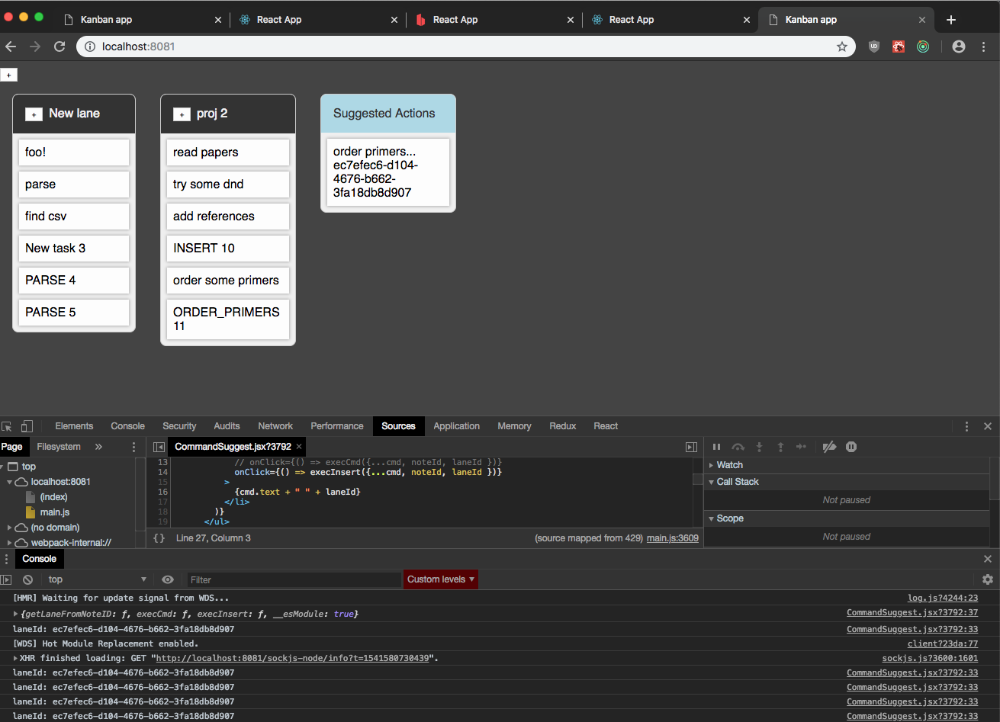

# list of code experiments

# `redux-observable/pingpong`
- need to learn epics or sagas redux reducer pattern
- rxjs looks good; own the manning book
  - although generator sagas seem elegant too...
- created codesandbox for playing aruond with `redux-observable` rxjs library
- also for prototyping redux-form solutions
- codesandbox: https://codesandbox.io/s/8npzmxoql9
- **TODO**
  - experiment w/ formik for forms! https://jaredpalmer.com/formik/docs/resources
- 

# `dev/jupyterlab/nbstencilaproxy`
- run stencila editor in jupyterlab, open [DAR archives](https://github.com/substance/dar)
- explanatory blog post: https://github.com/nuest/o2r-project.github.io/blob/elife-blog/_drafts/elife-sprint-integrating-stencila-and-binder.md
- nbstencilaproxy repo2docker stencila DAR adapter https://github.com/minrk/nbstencilaproxy
  - note: documents/implements how to change file system adapter for DAR server
- community forum post: https://community.stenci.la/t/stencila-in-binder/142
- also played around w/ stencila-cloud, director, editor, etc: `/Users/100ideas/dev/da-play/3_editors/stencila`
  - stencila-convert script is handy: `stencila/cli $ node bin/stencila.js convert Oligo_Synthesis_cgg.csv Oligo_Synthesis_cgg.sheet.xml`
  - A Docker image builder for researchers https://stencila.github.io/dockter/
- tweaked DAR archives:
  - `prevda-play/3_editors/stencila/hub/editors/textilla/dars`
  - `dev/jupyterlab/nbstencilaproxy/archive`
- figured out how to reference stencila spreadsheets in minicode and js code cells - see screenshot
- run stencila w/ repo2docker (from `dev/jupyterlab/nbstencilaproxy`):
  - `repo2docker --user-name joyvan --debug ./archive`
- 


# `didact/{@atlaskit|notebook}`
- repo uses yarn workspaces to override atlaskit packages
- notebook/
  - demonstrates how to use atlaskit component in react app
- `notebook/src/FetchBookMetadata.js`
  - fetch book metadata from openlibrary.org
- 

# `1_survivejs/hack-survivejs`
- dnd kanban demo w/ redux
- 
- also see `1_survivejs/kanban-survivejs-redux-demo/`

# `da-play/1_didact-nodelist`
- simple two-column frontend mockup of 1) atlaskit editor 2) spreadsheet, card, data table componenets
- `atlaskit` branch shows markdown w/ **slate.js editor**
- `redux` branch shows atlaskit quick-insert-provider customization `src/components/editor/helpers/quick-insert-provider.js`
- 

# `da-play/1_didact-redux-orm`
- demonstration of redux-orm w/ a basic didact schema:
```js
// src/bootstrap.js
{ "id": 0,
  "op": "ADD_FILE",
  "ins": [{
    "name": "2015-Walthers-COI1.pdf",
    "path": "uploads/2015-Walthers-COI1.pdf",
    "schema": 0,
    "id": 0
    }, {
    "name": "2018-Zooler-Barcoding_Fish.pdf",
    "path": "uploads/2018-Zooler-Barcoding_Fish.pdf",
    "schema": 0,
    "id": 1
  }],
  "outs": []
},
{
  "id": 1,
  "op": "REMOVE_FILE",
  "ins": [{
    "name": "2015-Walthers-COI1.pdf",
    "path": "uploads/2015-Walthers-COI1.pdf",
    "schema": 0,
    "id": 0
  }],
  "outs": [] }
```
- 

# `dat/hypercore-protocol-proxy-test/`
- serviceworker dat fetch proxy + dat websocket gateway

# `da-play/serviceworkers/choo-serviceworkers`
- more experimenting w/ serviceworkers & communication channels, this time w/ choo framework

# `da-play/z_mock`
- mock notebook files and lab data

---
# form management & dnd

- [Dynamic Forms with Formik in React with TypeScript](https://scottdj92.ghost.io/building-dynamic-forms-with-formik-with-react-and-typescript/ "Added on Thu Nov  8 15:40:30 2018")

    > Building forms has always been one of React's weaknesses. The unidirectional data flow paradigm in React doesn't mesh with the ephemeral-ness of HTML forms. To get around this, we'd need to leverage React's local state a

- [informative/README.md at master · bradwestfall/informative](https://github.com/bradwestfall/informative/blob/master/README.md "Added on Thu Nov  8 15:25:44 2018")

    > Informative is a <Form> and <Field> Compound Component Stratagy that keep track of form and field state for you and can provide it to you in a several of ways. Create basic fields with a "redux-form" style <Field /> API,

- [🏁 React Final Form - Third Party Components Example - CodeSandbox](https://codesandbox.io/embed/40mr0v2r87?codemirror=1 "Added on Thu Nov  8 14:54:10 2018")

    > CodeSandbox is an online editor tailored for web applications.


- [react-beautiful-dnd/README.md at master · atlassian/react-beautiful-dnd](https://github.com/atlassian/react-beautiful-dnd/blob/master/README.md "Added on Thu Nov  8 15:28:46 2018")

    > Beautiful, accessible drag and drop for lists with React.js Examples 🎉 See how beautiful it is for yourself! Viewing on a desktop All the examples! Viewing on a mobile or tablet Simple list Board - best viewed in

- [react-dragtastic/README.md at master · chrisjpatty/react-dragtastic](https://github.com/chrisjpatty/react-dragtastic/blob/master/README.md "Added on Thu Nov  8 15:27:11 2018")

    > A simple drag and drop library for React which uses the more stable mouseDown/mouseUp pattern instead of the problematic HTML5 drag and drop API. Drag and drop interfaces are complicated and difficult to properly program

- [upload/README.md at master · ConstructionJobs/upload](https://github.com/ConstructionJobs/upload/blob/master/README.md "Added on Thu Nov  8 15:18:03 2018")

    > v4 I'm working on a v4 soon that simplfies the api and removes the children-as-a-function paradigm to something more extendable. Also revamping the test suit. It'll be a complete rewrite. What A set of React components f

- [file-upload-component/fileUploadService.js at master · shystruk/file-upload-component](https://github.com/shystruk/file-upload-component/blob/master/react%2016.0/app/services/fileUploadService.js "Added on Wed Nov  7 07:06:23 2018")

    > React 16.0/Angular 1.6/Angular 5.0 components for file upload with multiple file selection, preview images, download, file thumbnail - shystruk/file-upload-component

- [loopmode/react-file-drop React component for Gmail or Facebook -like drag and drop file uploader](https://github.com/loopmode/react-file-drop#readme "Added on Wed Nov  7 07:05:21 2018")

    > React component for Gmail or Facebook -like drag and drop file uploader - loopmode/react-file-drop

- [react-droppad/README.md at master · Andrinoid/react-droppad](https://github.com/Andrinoid/react-droppad/blob/master/README.md "Added on Wed Nov  7 07:04:45 2018")

    > React-droppad is a simple to use component that provides drag'n'drop file uploads with nice UI Installation yarn add react-droppad or npm install react-droppad Usage Import react-droppad in your React component import
