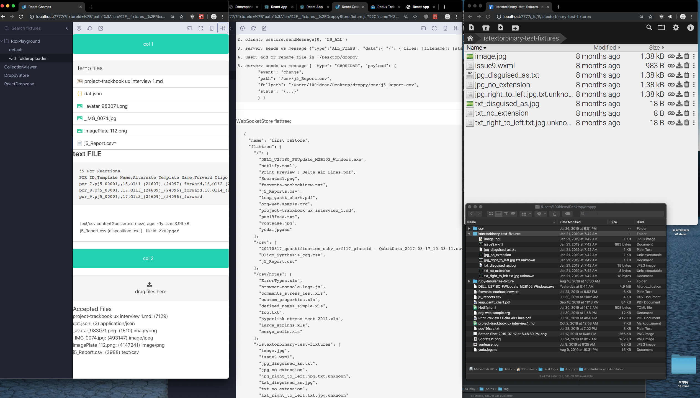
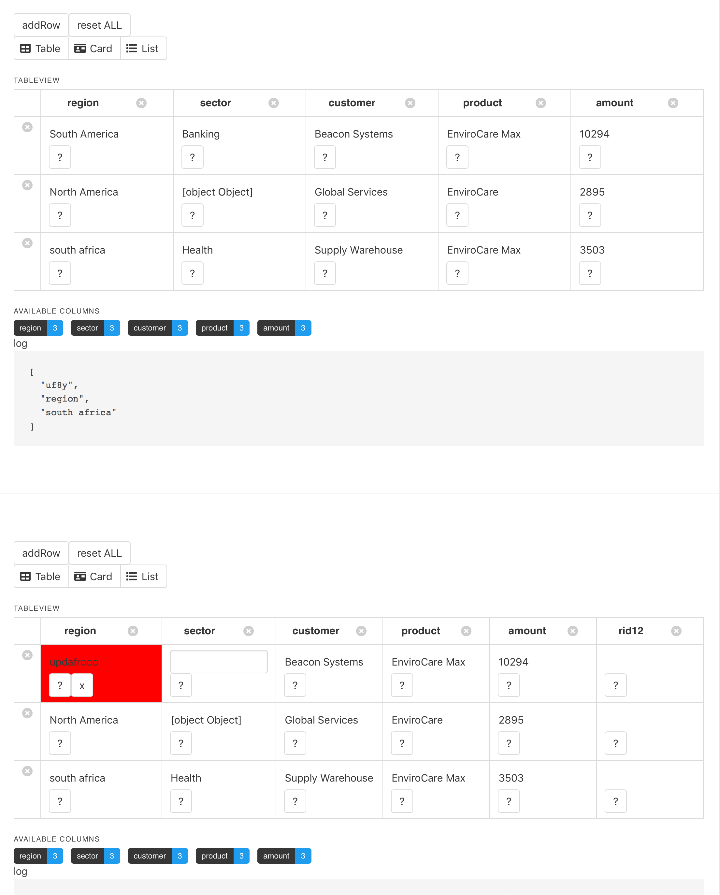
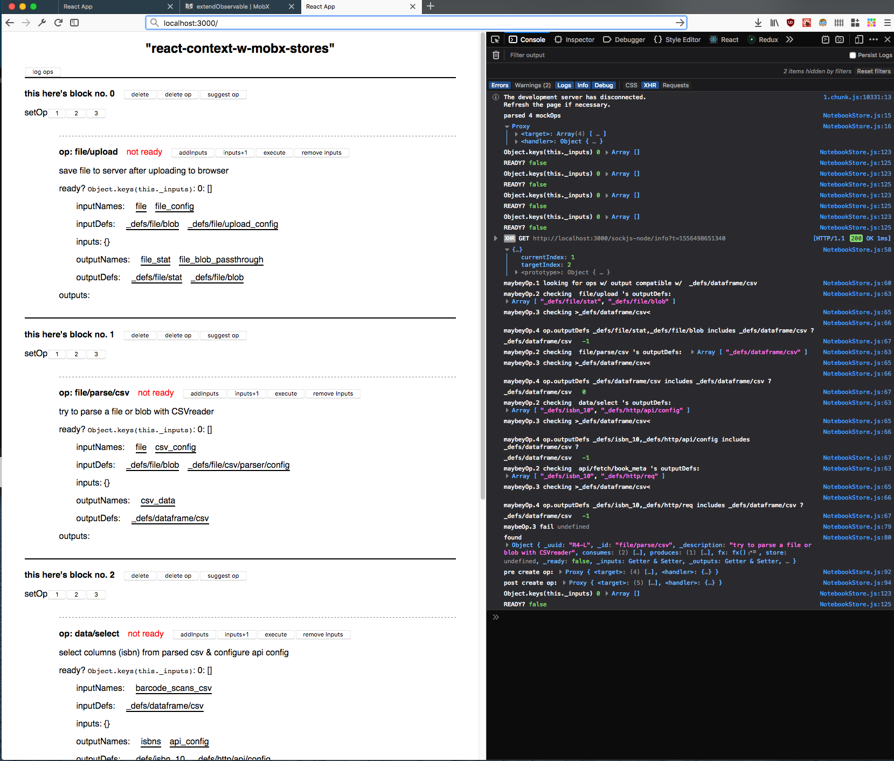
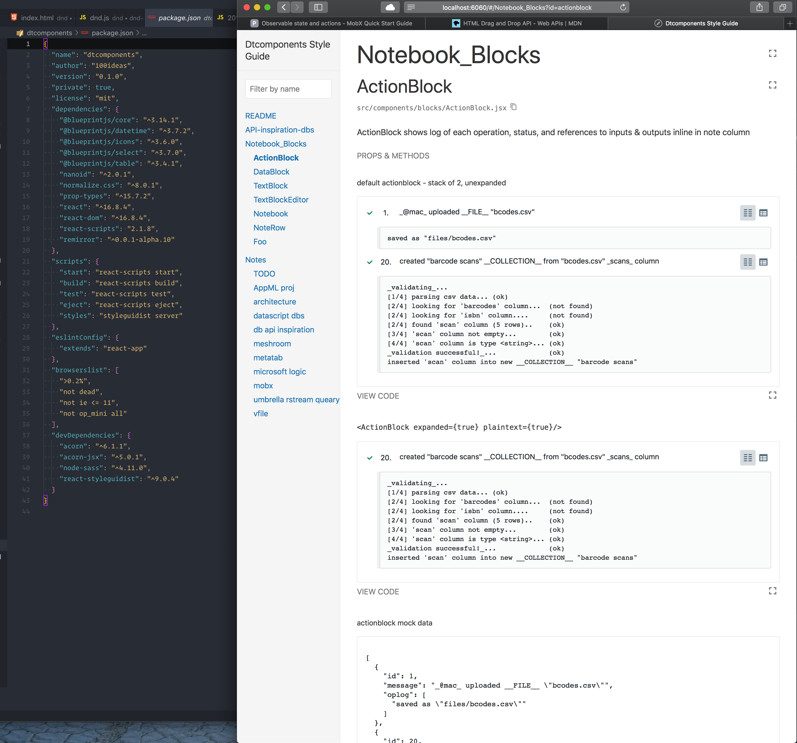
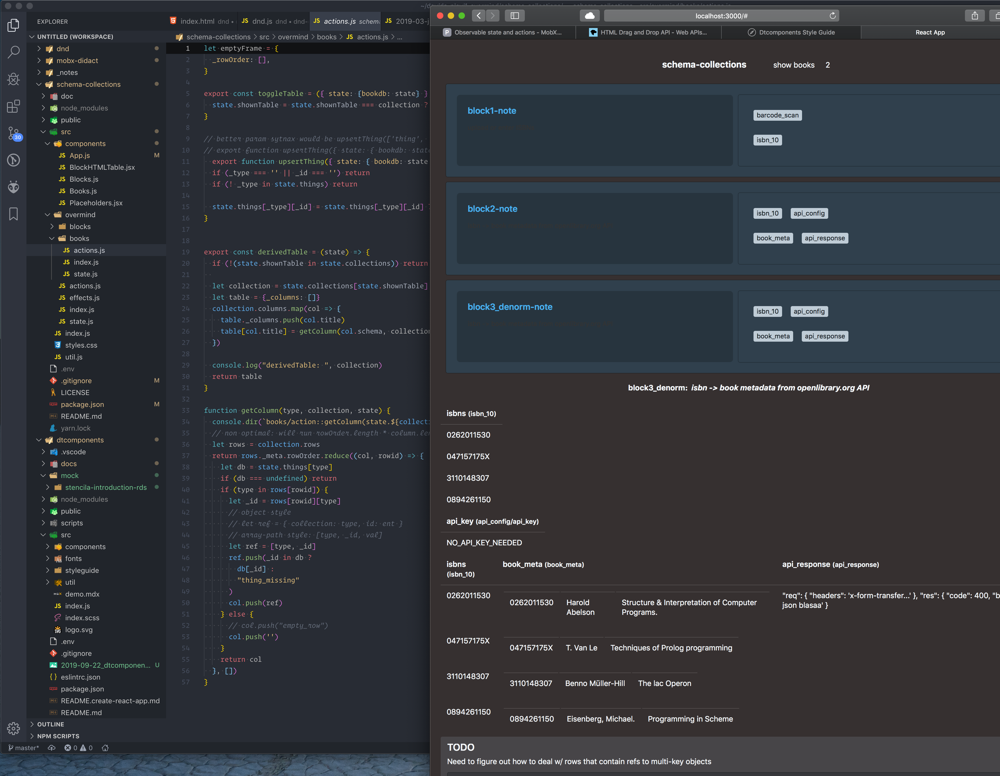
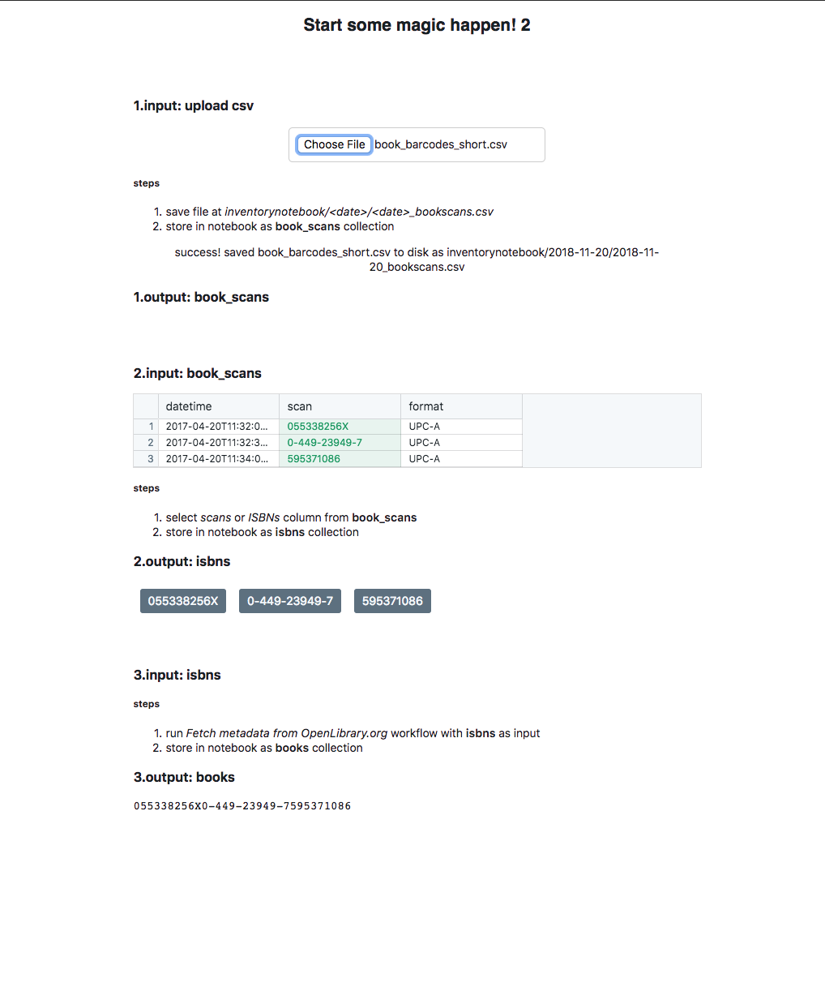

# 2019-09-23 experiments so far

## 2019-08: `da-play/0_mock/boilerplate-mobx-react-hot-loader/`
- needs a new name
  - name originally started as boilerplate repo didn't change
  - now using `react-cosmos` for live isolated component preview
  - supports drag-n-drop -> memory mobx store
  - droppy-server websocket api -> browser mobx store
  -
- 


## 2019-06: `da-play/0_mock/mobx-didact`
- 


## 2019-04: `da-play/0_mock/react-context-w-mobx-stores`
- 


## 2019-04: `da-play/1_overmind/dtcomponents`
- lots of great notes in this project:
  ```
  /Users/100ideas/dev/da-play/1_overmind/dtcomponents/docs
  ├── AppML_proj.md
  ├── _TODO.md
  ├── architecture.md
  ├── datascript_dbs.md
  ├── db_api_inspiration.md
  ├── images
  │   ├── event-sourcing-overview.png
  │   └── meshroom_screencap.png
  ├── meshroom.md
  ├── metatab.md // also has metatab schema docs
  ├── microsoft_logic.md
  ├── mobx.md
  ├── umbrella_rstream-queary.md
  └── vfile.md
  ```
- 


## 2019-03: `da-play/1_overmind/schema-collections`
- 


## 2018-12: `da-play/0_mock/bookstore-redux`
- built during thanksgiving
- redux-driven reactive notebook w/ blocks, operations, & data
- 


## 2018-11: `da-play/1_didact-nodelist`
- simple two-column frontend mockup of 1) atlaskit editor 2) spreadsheet, card, data table componenets
- `atlaskit` branch shows markdown w/ **slate.js editor**
- `redux` branch shows atlaskit quick-insert-provider customization `src/components/editor/helpers/quick-insert-provider.js`
- 


# 2018-10: `da-play/0_mock/archive/1_didact-redux-orm`
- demonstration of redux-orm w/ a basic didact schema:
```js
// src/bootstrap.js
{ "id": 0,
  "op": "ADD_FILE",
  "ins": [{
    "name": "2015-Walthers-COI1.pdf",
    "path": "uploads/2015-Walthers-COI1.pdf",
    "schema": 0,
    "id": 0
    }, {
    "name": "2018-Zooler-Barcoding_Fish.pdf",
    "path": "uploads/2018-Zooler-Barcoding_Fish.pdf",
    "schema": 0,
    "id": 1
  }],
  "outs": []
},
{
  "id": 1,
  "op": "REMOVE_FILE",
  "ins": [{
    "name": "2015-Walthers-COI1.pdf",
    "path": "uploads/2015-Walthers-COI1.pdf",
    "schema": 0,
    "id": 0
  }],
  "outs": [] }
```
- 

## 2018-06: `da-play/y_didact-archive/1_survivejs/hack-survivejs`
- dnd kanban demo w/ redux
- 
- also see `1_survivejs/kanban-survivejs-redux-demo/`

---

## more notes: `2018-11-7 story so far.md`